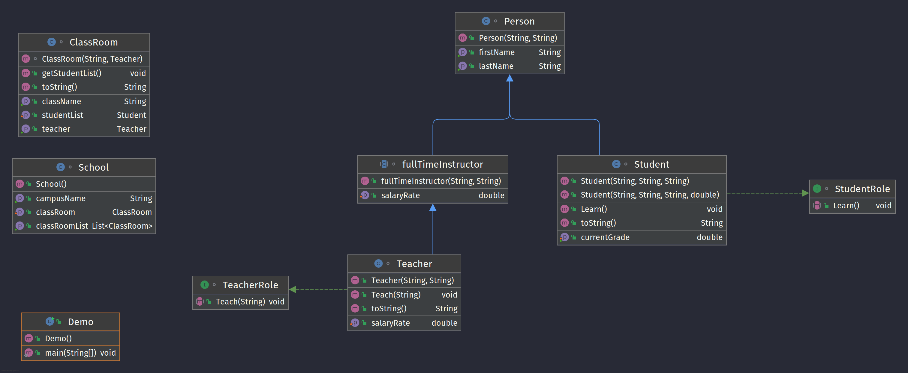

#  Inheritance and Abstraction LAB/HW

# Exercise 1

This lab will give you more practice creating abstract classes, subclasses, and interfaces.

You'll need to design a program that manages a school. 

- The school has classrooms
- The classrooms have teachers and students assigned to them. 
- Each classroom contains students in a single grade (i.e., first, second, third, and so on).

You decide what the actions and properties of each class will be.

#### Requirements

- At least one abstract class.
- At least one interface.
- At least three subclasses.
- Each subclass must be unique from the others.


## Sample UML diagram for the above requirements


**Bonus**: Add extra classes, subclasses, or interfaces.

#### Deliverable

Java code that meets all the requirements above.

# Exercise 2

## Algorithm question

Roman numerals are represented by seven symbols: `I`,  `V`,  `X`,  `L`,  `C`,  `D` and  `M`.

```
Symbol       Value
I             1
V             5
X             10
L             50
C             100
D             500
M             1000
```

For example, `2` is written as  `II` in Roman numeral, just two ones added together.  `12` is written as `XII`, simply  `X + II`.  The number  `27` is written as  `XXVII`, which is  `XX + V + II`.

Roman numerals are usually written from largest to smallest from left to right.  However, the numeral for four is not  `IIII`.  Instead, the number four is written as  `IV`.  Because the one is before the five, we subtract it, making four.  The same principle applies to nine, written as  `IX`.  There are six instances where subtraction is used:

-   `I` can be placed before  `V` (5) and  `X` (10) to make 4 and 9.
-   `X` can be placed before  `L` (50) and  `C` (100) to make 40 and 90.
-   `C` can be placed before  `D` (500) and  `M` (1000) to make 400 and 900.

Given an integer, convert it to a Roman numeral.
```
Input: num = 3
Output: III

Input: num = 4
Output: IV

Input: num = 9
Output: IX

Input: num = 58
Output: LVIII
Explanation: L = 50, V = 5, III = 3.


Input: num = 1994
Output: MCMXCIV
Explanation: M = 1000, CM = 900, XC = 90 and IV = 4.
```

```java
public class Roman {  
  public static String intToRoman(int value) {  
     // Here, we're returning an empty string, but you need to build your  
     // algorithm and return a String data type accordingly.  
     return "";  
 }  
  
  public static void main(String[] args) {  
  System.out.println(intToRoman(3));  
        System.out.println(intToRoman(4));  
        System.out.println(intToRoman(9));  
        System.out.println(intToRoman(58));  
        System.out.println(intToRoman(1994));  
 }  
}
```

Before you write code, think about the tools you have in your arsenal.  
- for loop, while loop
- arrays (char, int, double, long, Strings, etc.)
- Inbuilt methods inside the String class such as; `length()`, `charAt()`, and `ValueOf()` 
- Remember Strings are immutable, StringBuffer and StringBuilder are mutable
- Draw out each step of the algorithm first (tracing)
- Then, choose the correct tool to build your algorithm
