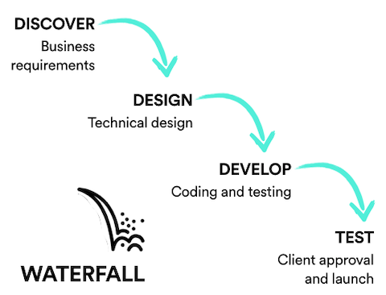
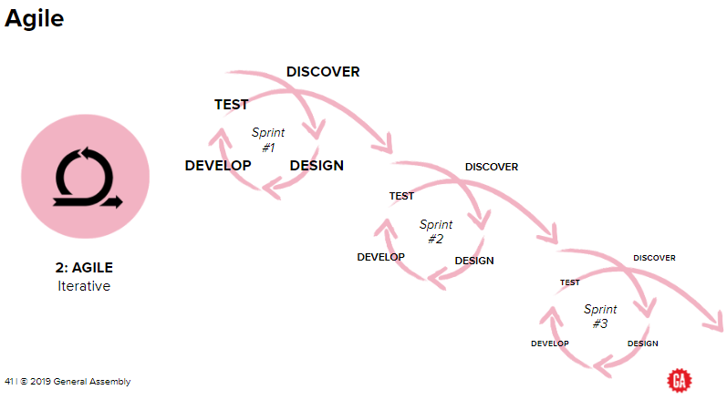

#  Agile in Action

### Learning Objectives

*After this lesson, students will be able to:*

- Discuss the challenges of product development.
- Evaluate pros and cons between common ways of working (Agile, Waterfall).
- Understand how Agile has been implemented in various settings.
- Discuss the challenges of implementing Agile.

### Lesson Guide

| TIMING  | TYPE  | TOPIC  |
|:-:|---|---|
| 10 min | Opening  | Lesson Objectives |
| 15 min | Discussion  | Agile vs. The Old Way |
| 30 min | Instruction | Case Study Review |
| 5 min  | Conclusion  | Review/Recap |

## Introduction (10 min)

Since its birth in 2001, Agile methodology has been practiced worldwide in diverse industries. It has spread beyond IT and software development to media and entertainment, finance, banking, and insurance. It has even gone beyond IT departments and been adopted by sales and marketing, finance/accounting, and human resources teams.

- National Public Radio employs Agile methods to create new programming.
- John Deere uses them to develop new machines.
- Saab relies on Agile to produce new fighter jets.
- C.H. Robinson, a global third-party logistics provider, applies them in human resources.
- Mission Bell Winery uses them for everything from wine production, to warehousing, to running its senior leadership group.

([Source](https://hbr.org/2016/05/embracing-agile))

### Talk It Out

As a group, let's discuss the following question:

Why do you think Agile methods have spread beyond IT and software development? 

Think of things like...
-	Focus on the customer.
-	Focus on delivering value quickly and incrementally.
-	Working in small teams.
-	Working in multidisciplinary teams.

---

## Agile vs. The Old Way (15 min)

To really understand why people get so excited about Agile, it’s helpful to think about the old way products were built: A process called **Waterfall**.

Waterfall is a linear, sequential development methodology. Each step in the process must be completed before the next can begin. It starts with a requirements-gathering process, followed by design, then development, then delivery. There’s typically a “gate” between each step, meaning that any progress must be approved and documented before the team can move on. Products are launched only once, when all requirements and features have been built.

Agile is an iterative development process. Agile is all about getting a product out to customers quickly and then getting and integrating their feedback. With Agile methods, instead of building the whole product, you build the smallest possible useful part and give it to users, who tell you what is right and what is wrong. Agile enables quick adaptation and prioritization, resulting in quicker time-to-market and adding continuous, incremental value to the business. 

> **Knowledge Check**: What is a major benefit of Agile over Waterfall?

Agile is all about getting a product out to customers quickly to gather and integrate their feedback. You build the smallest possible useful part and give it to users, who tell you what is right and what is wrong. By contrast, Waterfall focuses more on fully scoping and completing a project before releasing anything.

Waterfall is sort of “the way things have always been.” In legacy Waterfall approaches, lots of work is completed over long periods of time and released as big bundles with the hope that users/customers want it in a way that adds value to the organization. 

> **Knowledge Check**: What attracts teams to working with Agile?

Agile started as a methodology for developers, but many organizations have adopted it as "a set of principles that promotes collaboration, cross-functional teams, response to change, and early and continuous delivery.” Those are things we can all get behind!

---

## Agile Case Studies (30 min)

Enough talk. Let's look at how Agile methodology plays out in some famous businesses!

We'll walk through three companies that implement Agile in very different ways. After we talk through each case study, we'll take some time to discuss *how* Agile works in that business and *why*.

### Spotify

If you’re a music fan, using Spotify can feel like a magical experience. Having instant and free access to more than 30 million songs is something that none of us even dreamed of a decade ago.

Spotify has implemented an Agile mindset that combines Scrum and Kanban methodologies. It has development teams organized into “squads.” Each squad is self-contained, self-organized, and responsible for a single aspect of the Spotify user experience: One squad for playlists, one for search, one for payments, one for the Android client, and so on.

Each squad has its own area in the office; the space is organized to promote collaboration and emphasizes communal meeting areas. A product owner keeps the squad’s business and tech concerns top of mind, while an **Agile coach** helps identify and guide it through any impediments to the Agile process.

Squads that work in related areas are grouped into tribes of about 100 people apiece. They hold informal gatherings and collaborate on the occasional project, enjoying a “hack day” once every two weeks. If the squads are like tiny startups, then the tribe would be an “incubator.”

Assisting squads with their frequent releases is a robust operations team. Spotify has created an infrastructure that allows for incremental updates to individual parts of the platform. If a squad releases an update that breaks one feature of the service, the other features should continue operating.

**Discuss**:
- Think of places you've worked before. How is the squad approach similar to or different from ways you've worked? 
- Do you think the squad method would be successful at other places you've worked? Why or why not?
- What factors make Agile useful for product development at Spotify? 

### The Home Depot

The Home Depot (THD) develops 90% of its own software, and its goal is “to provide software that is customer-focused to customers, associates, and business problems.” After nearly 40 years in business, the company undertook an enormous change, moving from Waterfall to Agile.

THD’s transformation started in 2016 when the company expanded lessons learned from Agile (while developing applications online) to its enterprise side (composed of all in-store products and services).

THD implements Agile with balanced teams made up of user experience designers, full-stack engineers, and a product manager. The Scrum master role is shared across product teams. THD uses paired programming, and co-location is a priority.

THD’s mobile app search feature was developed with the customer in mind and is an example of Agile in action. On the app, a customer can search for an item via voice or keyboard entry. The app returns the shelf and bay product where the customer can find the item in the brick-and-mortar store.

To achieve this customer experience, THD teams had to adapt to working in a user-centric way that leveraged Agile product-based development. This required the transition of project managers and analysts to product management and product owner roles, a transition with the potential to create valuable business insights.

*“The technology leaders that can lean in and help the business partners and key stakeholders think about things differently are absolutely creating significant value for the organization.” Matt Carey, CIO* ([Source](https://blogs.wsj.com/cio/2018/04/19/home-depot-plans-biggest-tech-hiring-push-in-its-history-led-by-cio/))

THD’s transformation continues to be a work in progress, challenging its business leaders to understand how THD can benefit from Agile’s customer-focused, multidisciplinary approach above and beyond the timely delivery of specific software products.

**Discuss**:
- Get inside their heads: Why do you think leaders at THD made the decision to transition to Agile? What factors may have motivated them?
- What obstacles might THD have faced when transitioning from Waterfall to Agile?
- How else could Agile methods benefit THD?

### Coca-Cola 

In 2016, Coca-Cola announced its “Agile transformation.” The announcement was a deliberate response to lagging sales of its flagship products in its biggest markets due to changes in consumer tastes and priorities.

The “command and control” leadership culture it was accustomed to was no longer resulting in success. Coca-Cola recognized that its employees were best positioned to stay in tune with (and adjust to) new consumer preferences. Agile presented a pathway to instill new mindsets in leaders and associates alike. The goal of Agile was to decrease the focus on finding the perfect answer and encourage experiments with new products and ideas.

*“We’re going to be more Agile, always with a destination in mind, but trying more pilots in the short term.” James Quincy, COO* ([Source](https://www.coca-colacompany.com/stories/5-Things-We-Learned-From-Cokes-CAGNY-Presentation))

In 2017, Coca-Cola added a new award dedicated to championing examples of “test and learn” mindsets across the enterprise. Called the “Celebrate Failure Award,” the first recipient was the failed launch of Sprite 3G in Pakistan.

The head of sparkling soft drinks in Pakistan developed and launched a new product called Sprite 3G to try to compete with a fierce regional competitor. The product failed and the competitor gained market share. The team conducted a retrospective to assess why the product failed. It used the learnings to pivot to a new soft drink that is performing well. The test-and-learn method has seen great success. 

The innovative, no-sugar beverage (Coca-Cola Zero Sugar) was the first product introduced in waves through different iterations, with launch learnings applied to each new market along the way.

Three big things happened:

* Coca-Cola planned for a 1.0, 2.0, 3.0 phased launch approach with product iterations between each phase.
* The launch timeline of Coca-Cola Zero Sugar was cut by more than half, from the typical 52 weeks to 22 weeks.
* Coca-Cola Zero Sugar delivered double-digit growth in 2017, outperforming previous new products when compared to the same time period.

**Discuss:**
- How did Coca-Cola know it was time to transition to an Agile way of working?
- How does the development and launch for the Coca-Cola Zero Sugar product reflect Agile best practices and principles?
- Think about the Celebrate Failure Award. What impact might this have had on Coca-Cola's culture overall?

---

## Conclusion (5 min)

*	What are the differences between Waterfall and Agile?
*	What makes Agile valuable for an organization?
*	What are the challenges of implementing Agile in an organization?

#### Resources

* [The State of Scrum Report, 2017 Edition](https://www.scrumalliance.org/ScrumRedesignDEVSite/media/ScrumAllianceMedia/Files%20and%20PDFs/State%20of%20Scrum/State0fScrum_2016_FINAL.pdf?aliId=261272923)
* [Ten Reasons People Resist Change](https://hbr.org/2012/09/ten-reasons-people-resist-chang)

