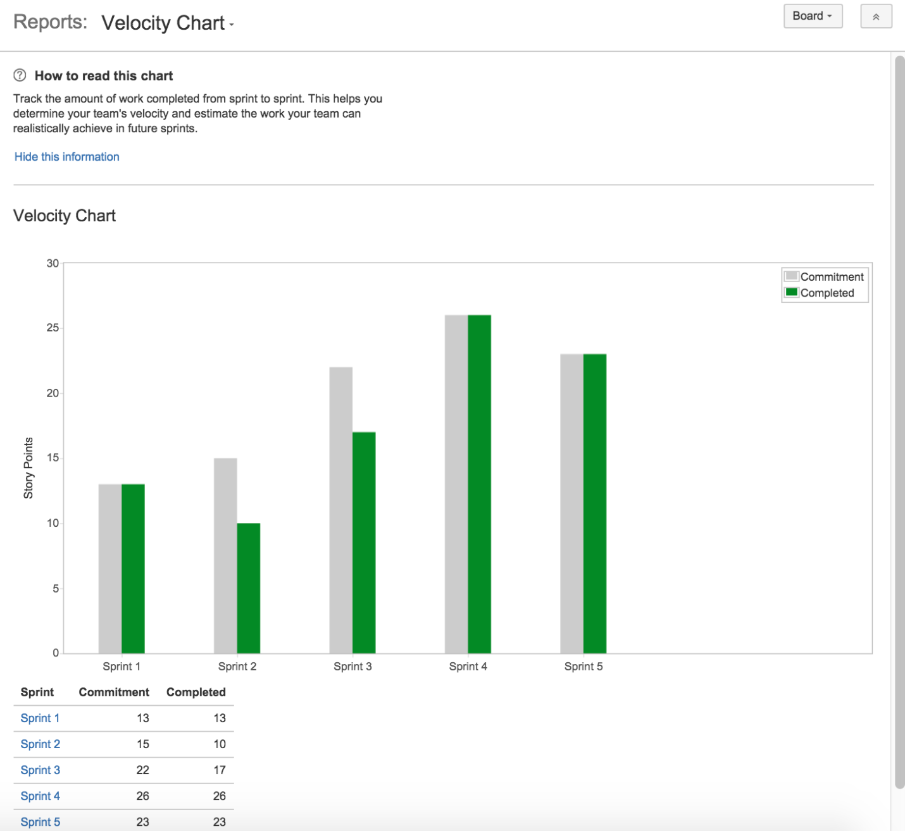
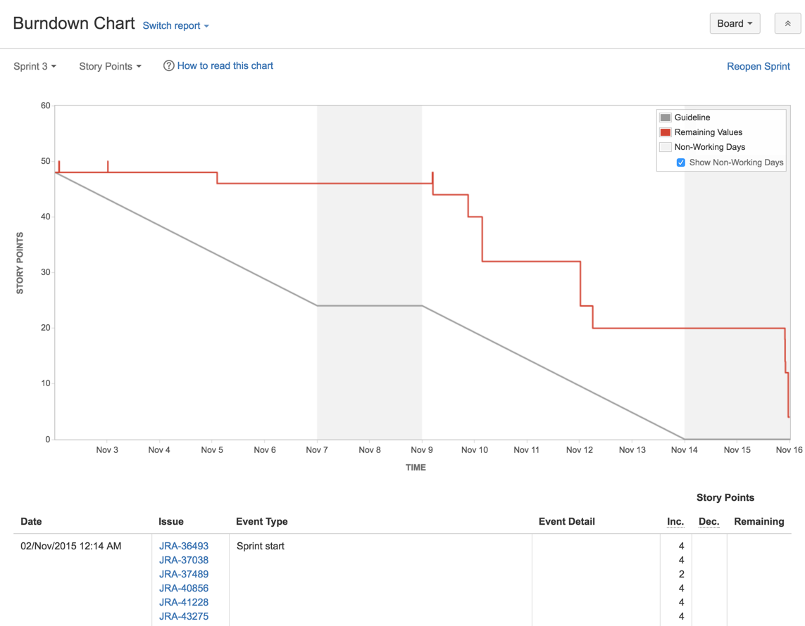
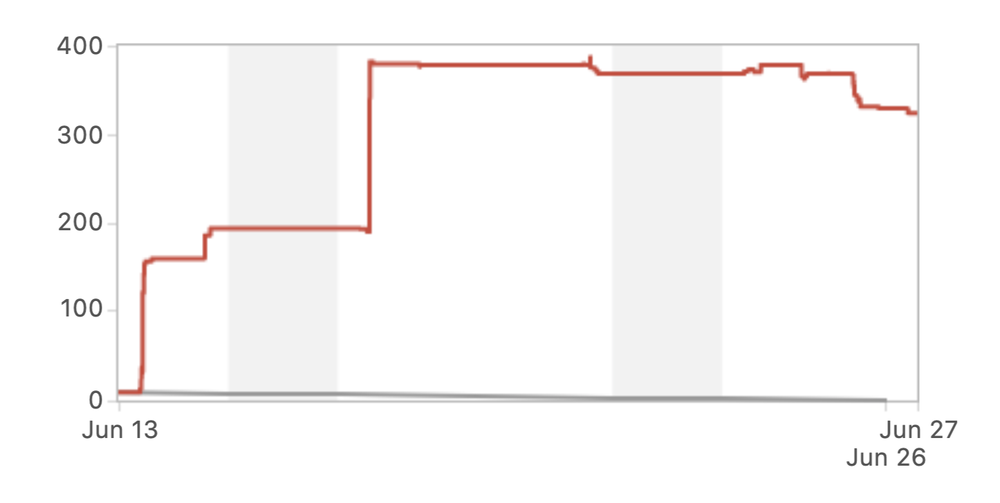
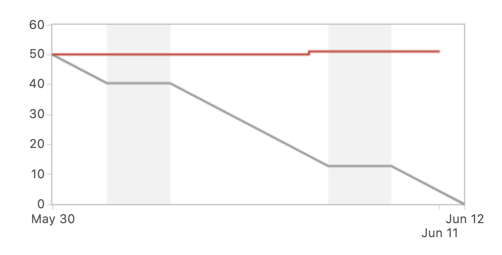
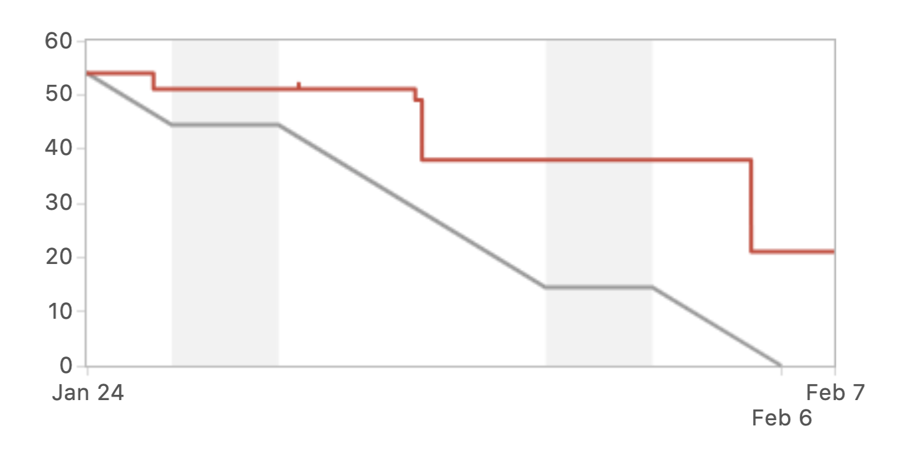

#  Agile Processes for Leaders  

### Learning Objectives

*After this lesson, students will be able to:*
* Describe responsibilities and tasks of Agile/XP team leaders.
* Manage a team's backlog and plan a sprint.
* Track a team’s velocity/burndown and use that information to improve planning.

### Lesson Guide

| TIMING  | TYPE  | TOPIC  |
|:-:|---|---|
| 5 min  | Opening | Welcome |
| 15 min | Instruction | Managing the Backlog and Sprint Planning |
| 15 min | Instruction | Tracking Team Velocity and Burndown |
| 50 min | Exercise | Backlog and Sprint Exercise |
| 5 min  | Conclusion | Review/Recap | 

## Introduction (5 min)

Can anyone recap what we learned about Agile/XP leadership in a previous lesson?

> Agile/XP strikes a balance between a centralized leadership structure that controls every aspect of a project and a completely decentralized leadership structure where everyone sets their own course and makes their own decisions.

XP teams are lean and flexible with collective ownership of the process and code. Work is based on communication, simplicity, feedback, and courage. In this type of environment, good relationships and trust are the keys to success. Leadership rests on accepted responsibility. 

In this lesson, we’ll look at some of the practical, on-the-ground tasks and responsibilities that Agile/XP leaders must fulfill as they lead their teams through the different phases of sprint planning and execution.

---

## Managing the Backlog and Sprint Planning (15 min)

### Preparing and Managing the Backlog

The backlog is a list of items that lead to the release of your product. It’s not a product wish list or a list of everything you can think of about the product, including the kitchen sink. The backlog is a list of items that should focus product deliverables and help keep the team focused on sprint deliverables.

Typically, the backlog will include the following types of items:
* Features
* Bugs
* Technical work
* Research and knowledge acquisition

Features are usually expressed as **user stories**, while **bugs** describe flaws or unexpected behaviors that need to be fixed. **Technical work** refers to, for example, updates in operating systems or tools on developer workstations. **Knowledge acquisition** relates to things like research of programming libraries or tools required for development.

The **product owner** is responsible for the backlog. They'll show up at a planning meeting with a backlog that’s been reviewed and prioritized. The team will then review the backlog, starting at the top of the prioritized list. Together, the team decides what can be realistically accomplished in the coming sprint. During the meeting, items are moved into the sprint and expanded into tasks.

#### Discussion

As a group, suggest a list of questions to help a product owner prepare the backlog prior to a sprint planning meeting. 

Answers might include:
*	Are the items organized?
*	Are user stories grouped into epics?
*	Have dependencies between items been identified?
*	Is the item relevant or should it be removed?
*	Does each item have a defined deliverable?
*	Does each item have defined acceptance criteria?

### Sprint Planning

The sprint planning meeting occurs at the start of a project and should be attended by the whole team. Sprint planning will keep your team focused on its goal and ensure that everyone is clear on the objectives for the upcoming work.

The **Scrum master** will lead this meeting, and the product owner should have a healthy backlog ready for the team to review.

Here's what a typical sprint planning meeting might entail:
* **Selecting high-priority issues from the backlog**: The product owner may come into the meeting with a suggestion of issues to include in the sprint. The team should discuss these as a group and decide together on what should be included.
* **Estimating user stories**: Ballpark the amount of time or effort it will take to complete an item in the backlog. The product owner may come into the sprint planning with estimates that the team should then discuss as a group.
* **Estimating the team’s availability**: Measure everyone’s availability. How much time will people have to work on the tasks in the upcoming sprint? Remember to include company holidays and personal time off. All team members should calculate their available time prior to the meeting.
* **Prioritizing and assigning tasks**: Expand user stories into tasks. Prioritize and assign tasks. At the end of the meeting, all tasks should be assigned and have time estimates. Make sure to review available time versus estimated time on assigned tasks to ensure a balanced workload for all team members.

---

## Tracking Team Velocity and Burndown (15 min)

**Velocity** is a measure of the amount of work a team can tackle during a single sprint. It’s a key metric in Scrum. Velocity can be calculated by totaling the points for all complete user stories.

Here’s an example of a velocity chart from Atlassian’s Jira software. A velocity chart will help you determine how much work you can expect your team to accomplish in future sprints:

Typically, team members enter the status and time worked on their tasks while the sprint is in progress. The Scrum master is responsible for reviewing the tasks and ensuring that entries and information are complete and up to date. This context is essential, as it's used to generate velocity and burndown charts for tracking progress.

The **burndown chart** tracks velocity during the sprint, comparing work that's completed against work that's yet to be accomplished. This also is an example from Jira. The Scrum master should check the burndown chart frequently to spot issues:

### Analyzing Sprint Trends

Below are a few examples of what a burndown chart might look like. As a class, we'll discuss what the chart might be telling us and how we as leaders would address these issues with our teams.

#### Example No. 1

 

**What is this burndown chart is telling us?**
* There is evidence of scope creep.
* Tasks are being added mid-sprint.

**How might we address what this burndown chart is telling us?**
* Consider sending items that were not in the original sprint to the backlog.

#### Example No. 2

 

**What is this burndown chart is telling us?**
* There's a plateau — it appears that work is not being accomplished as expected.
* We should ask: 
    * "Do we have staffing problems?"
    * "Is the team blocked?"

**How might we address what this burndown chart is telling us?**
* Consider reducing the sprint.
* Consider closing out the sprint early.

#### Example No. 3

 

**What is this burndown chart is telling us?**
* Features are not being completed.
* There are too many features.
* This was a poor estimation of work.

**How might we address what this burndown chart is telling us?**
* Consider reducing the scope.
* Consider closing out the sprint early.

------

## Backlog and Sprint Exercise (50 min)

For the rest of the lesson, we're going to put these practices to use! We'll be working in Agile teams to renovate a kitchen (or another room of your choosing).

### Preparation

Let's get into groups of about six people. We'll assign a few roles:
- One product owner
- One Scrum master
- Team members (i.e., the rest of the group)

Work through each of the sprint ceremonies listed below as if you were running a sprint to start the renovations.

### Backlog Grooming (15 min)

In this phase, you'll work to create and prioritize a backlog for the kitchen renovation project.

- The product owner describes what should be built for the new kitchen.
- A member of the team writes down each requirement on an index card in the format of a *user story*.
- After a few items are added, the team sizes (adds points to) the stories. Write the size on each card. (To help scale, pick one story. Assign it a value of "2" and scale other stories by comparison.)
- The product owner prioritizes the stories with input from the team.
- The team rearranges the cards with the most important on top.

The Scrum master should manage time, make sure that all requirements are written as user stories, and ensure that all stories have reasonable points.

### Sprint Planning (15 min)

In this phase, you'll move items from the backlog into the upcoming sprint and make sure that the stories are good to go. The upcoming sprint will last for two weeks.

**Part 1**

- The product owner takes the top-priority stories from the backlog.
- The product owner describes what they want for the first story. The team members ask questions to clarify the deliverable.
- The Scrum master asks the team, “Can you finish this in the next sprint?” The team confirms the feasibility of the item.
- Repeat these steps until team members feel like they have enough to do in the sprint.

**Part 2**

- The Scrum master asks the team to identify what tasks need to be done for each story. They also should identify acceptance criteria and the definition of "done" from the product owner’s perspective.
- The Scrum master writes down the tasks and acceptance criteria for each story on a separate index card.
- Each team member should choose stories to work on during the sprint until all stories are assigned to a team member.
- Part 2 is complete when all stories have been discussed and documented.

### Standup (10 min)

Once sprint planning is complete, the sprint is underway! That means it's time for a daily standup. (This part of the activity will take some imagination on the part of the group.)

- Team members share what they completed and what they're working on and introduce some blockers; for example, missing or incorrect materials, an injured or sick worker, missing or incorrect tools, or delayed delivery of materials.
- The Scrum master writes a sticky note for each blocker and facilitates a discussion with the group about how to resolve it.
- The Scrum master moves the stories that have been completed into a "done" area and creates a draft burndown chart.

### A Brief Debrief

In a group discussion, each team reports briefly on its experience. Are there similarities between teams? What did each team learn or realize during the mock sprint?

---

## Conclusion (5 min)

* What are the key tasks and responsibilities of Agile/XP leaders?
* What is the value of a well-maintained backlog?
* What is velocity and how can you track it?
* What can a burndown chart tell you?
* What strategies can you use to manage issues during a sprint?

#### Resources 

* [Leadership in Agile Projects — What Makes for Success?](https://www.pmi.org/learning/library/leadership-agile-projects-makes-success-7592)
* [Why Agile Goes Awry — and How to Fix It](https://hbr.org/2018/10/why-agile-goes-awry-and-how-to-fix-it)
* [Understanding Agile Management](https://hbr.org/ideacast/2016/04/understanding-agile-management.html)
