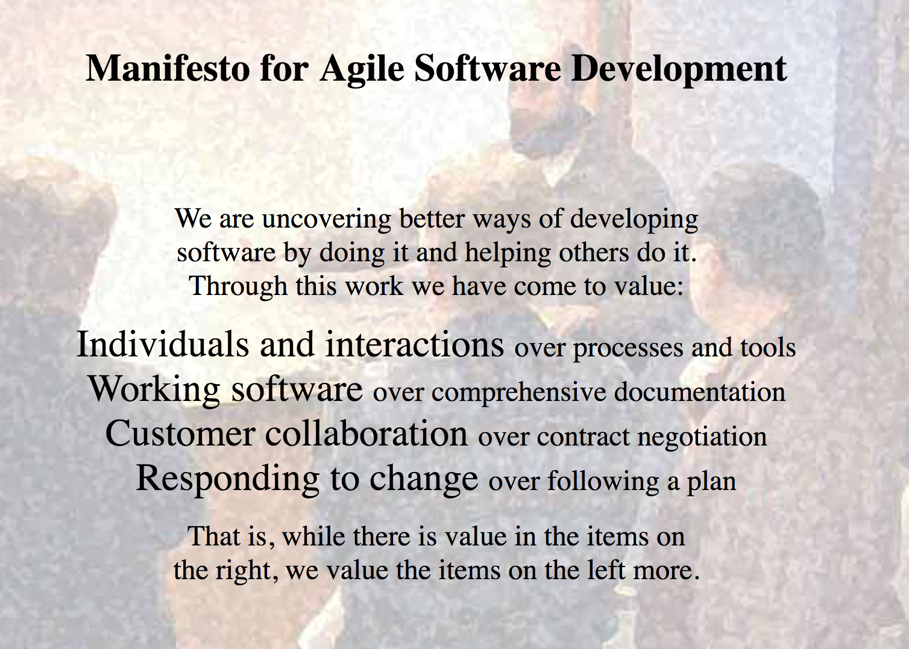
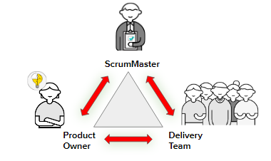
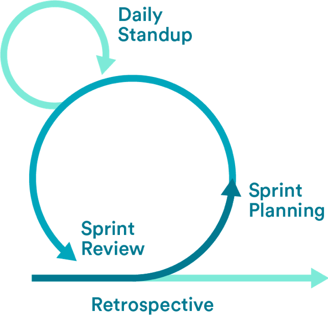
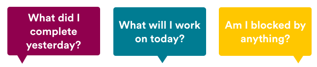
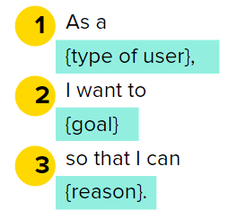
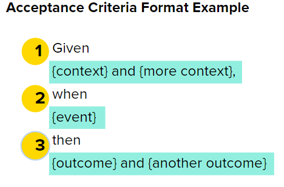

#  Agile and User Stories

### Learning Objectives
*After this lesson, students will be able to:*
 - Define the core principles of Agile.
 - Differentiate between the various versions of Agile.
 - Explain the different Scrum roles.
 - Identify the different stages and rituals of a sprint cycle.
 - Explain the value of user stories and acceptance criteria.
 - Write a compelling user story and accompanying acceptance criteria.

### Lesson Guide

| TIMING  | TYPE  | TOPIC  |
|:-:|---|---|
| 5 min  | Opening  | Welcome/Lesson Objectives |
| 10 min | Instruction  | The Agile Manifesto |
| 10 min | Instruction  | Overview of Scrum, Lean, and Kanban |
| 10 min | Instruction  | Overview of Scrum Roles and the Sprint Cycle |
| 10 min | Instruction  | Overview of Scrum Ceremonies |
| 10 min | Discussion   | Strategies for Running a Successful Scrum |
| 10 min | Discussion  | Writing User Stories |
| 10 min | Exercise | Judging User Stories |
| 10 min | Exercise  | Writing User Stories |
| 10 min | Discussion | Acceptance Criteria |
| 10 min | Exercise | Writing Acceptance Criteria |
| 5 min  | Conclusion   | Review/Recap |

## Introduction (5 min)

Agile software development is a set of frameworks and practices based on the values and principles expressed in the Manifesto for Agile Software Development and the 12 principles behind it.

The Agile methodology follows the same basic steps as any other product development framework: planning, building, testing, and deploying. However, its steps are broken into small batches, completed in an entire cycle, and repeated frequently. Each complete cycle is known as a **sprint**. The length of a team’s sprint varies depending on product complexity, team size, location, and test capacity.

-----

## The Agile Manifesto (10 min)

"On February 11-13, 2001, at The Lodge at Snowbird ski resort in the Wasatch mountains of Utah, 17 people met to talk, ski, relax, and try to find common ground — and, of course, to eat. What emerged was the Agile ‘Software Development’ Manifesto. Representatives from Extreme Programming, Scrum, DSDM, Adaptive Software Development, Crystal, Feature-Driven Development, Pragmatic Programming, and others sympathetic to the need for an alternative to documentation-driven, heavyweight software development processes convened.

"Now, a bigger gathering of organizational anarchists would be hard to find, so what emerged from this meeting was symbolic — a Manifesto for Agile Software Development — signed by all participants. The only concern with the term 'agile' came from Martin Fowler (a Brit), who allowed that most Americans didn’t know how to pronounce the word ‘agile.'"

That is how Jim Highsmith, one of the manifesto's authors, described this important gathering.

### So, What Did They Come Up With?

> **Knowledge Check**: As we go through each part of the manifesto, call out a few ways you think this plays out in the workplace.

*    **Individuals and interactions over processes and tools.**
     * Agile prioritizes customer feedback and collaboration and working with customers and clients.
     * You can solve problems faster and more effectively with communication instead of checklists.

 *   **Working software over comprehensive documentation.**
     * In Waterfall, your project isn’t completed until you complete all the requirements in the project's documentation. With Agile, “done” increases every step along the way. It doesn’t leap from 0% to 100%, and no one will miss the documentation.

* **Customer collaboration over contract negotiation.**
     * You create an adversarial relationship with your customers when you throw requirements over the wall (when you tell your team what to do and how to do it). Instead, partner with your customers throughout the project. Embrace learning and responding to their changing needs. We must be open to incorporating customer change to learn and grow with them.

* **Responding to change over following a plan.**
     * Embrace change. The Agile method is organized to allow teams to respond rapidly when changes occur. You can’t adapt in Waterfall if better opportunities arise during the project.
     * Example: You’re developing a mobile phone and a new, better CPU launch, but you can’t adjust your plans to accommodate it. Not changing can also increase costs because you put so much effort into building the wrong thing and then have to rebuild it after it has already been shipped.

---

## Overview of Scrum, Lean, and Kanban (10 min)

Agile is a concept: A collection of principles and ideas that describes how teams can build products quickly and remain focused on the customer. However, Agile differs from working with defined roles, processes, and tools.

To “be” Agile, you must choose a development methodology to help implement its principles and ideas. The three most common methodologies are:

*    **Scrum**
     * One of the most prevalent and widely adopted Agile methodologies in software development.
     * Notable for its incorporation of a position known as **Scrum master**.
     * Highly structured, with timetables of daily meetings and a commitment to delivering working code to the customer every two weeks.

*    **Lean**
     * Designed for teams to get quick customer feedback.
     * Focused on building a minimum viable product (MVP), testing, and iterating on it. An MVP is a product version with the core features necessary to deploy and satisfy customers and nothing else.
     * By releasing a product in an MVP form, teams can move quickly and receive customer feedback more regularly.

*    **Kanban**
     * Known for being less structured than Scrum.
     * Based on a prominently displayed Kanban board that provides workflow visualization, organization, and tracking for each project element.
     * Reliant on a very disciplined team.

### Which Method Is Best?

It depends.

There are many factors to consider when choosing a development methodology, even if you’re testing it out for a short time.

Here’s a comparison of the three Agile methods, as well as the more traditional Waterfall method:

| Methodology | Pros | Cons  |
| ------------- |:-------------|:-----|
| **Scrum** | Large projects are divided into easily manageable chunks and can be adapted over time. | The process takes a lot of work to adapt for large teams, and it can take a long time for newer team members to adapt.|
| **Lean** | An intense focus on user needs means that everything built is valuable to customers. | Can become too focused on customer requests rather than strategic positioning or market growth. |
| **Kanban** | A more fluid process, focusing on what needs to get done next instead of timelines and milestones. | Very tactical and doesn’t focus on long-term, strategic vision. |
| **Waterfall** | It makes predicting what will be delivered at the end of the development cycle easier.| Many assumptions are made and committed to early in the process that can later prove invalid.|

> **Knowledge Check**: Why can Agile be scary or complex for companies to implement?

---

## Overview of Scrum Roles and the Sprint Cycle (10 min)

There are three typical roles on an Agile Scrum team:

* Product owner.
* Scrum master.
* Delivery team.

The **product owner** owns “what” is desired and “why” it’s desired. They are responsible for prioritizing work. They are the voice of the customer and understand the big picture, business, competition, customers, trends, etc.

The **Scrum master** is the keeper of the Scrum process. They are facilitators whose goal is always to make the team as efficient as possible. They used to be considered project managers, but this role focuses more on facilitating and creating team efficiency. They may work with other teams to obtain resources, training, or support.

**The Scrum delivery team** owns “how” and “how quickly” work is delivered. This team includes everyone responsible for providing work. It comprises engineering and design people but may include marketing, support, and operations.

### Scrum and the Sprint Cycle

**Step 1: Plan**

Ask yourself, “What feature is most valuable to the customer?” and build that first. Collaborate with the business, if possible, to help pin down customer preferences.

**Step 2: Design**

Mock up a complete solution that includes front-end, back-end, and middleware. At this point, the team collaborates to create a complete list of technical tasks.

**Step 3: Build**

Write the code. The groundwork you laid in the previous two steps pays off here, keeping everyone organized and focused on a task. Frequent check-ins are strongly advised to ensure compatibility and minimize unexpected roadblocks.

**Step 4: Test**

Put the software through its paces. Make sure everything works as expected and integrates appropriately with existing software.

**Step 5: Deploy**

Get the software into customers’ hands. The speed of this process can be astonishing, primarily if you’re used to the traditional way of doing things. The trade-off for all this speed is that unit testing becomes an essential part of the process for every piece of functionality in the software. This sounds challenging initially, but the continuous deployment environment makes it less daunting.

A mature Agile system can complete all five steps in a single sprint. This means the software can be used from the very first sprint onward. Every sprint after that, the application grows in functionality and value through slow iteration.

---

## The Four Ceremonies (10 min)

A sprint is a short, time-boxed period (often two weeks) during which a team completes a set amount of work. A lot happens in that period (work gets done, product launches), and everything starts again.

To help teams stay on track, four ceremonies occur at different points in the sprint to ensure work is completed as efficiently as possible. These include:

* Sprint planning
* Daily standups
* Sprint reviews
* Retrospectives

### Before You Get Started

Before you get started, the backlog must be complete and in order. The backlog lists user stories, bugs, and other work in priority order. The product owner owns the backlog, and the product management team determines the order. The backlog will be constantly “groomed" during the project, with the highest-priority tickets appearing at the top.

### Sprint Planning: First Things First

Once the backlog is in order, you can turn your ideas into something usable. In **sprint planning**, you Review what needs to be done and clarify the tasks so the development team is ready to start building.

Sprint planning is one of the Scrum rituals that needs to be followed. It happens right before a sprint starts. Sprint planning aims to ensure that the tickets in your backlog are ready to be moved into that sprint planning backlog as well. Your sprint planning backlog is a subset of the product backlog; it’s whatever is the highest priority and needs to be done in the upcoming sprint.

In the sprint planning meeting, you need to be able to present the user story, along with acceptance criteria, to your development team. As a product manager, your job is to make sure that you’ve identified the “what” they need to build and the “why” they need to build it; let your development team figure out the “how.”

### Time to Stand Up

| Attendees | When | Duration  | Inputs | Purpose |
| :-----: |:-------:|:-----:|:-----:|:-----:|
|Product owner, development team, and Scrum master| Once a day, often in the morning. | At most 15 minutes. | None — just attendance from all team members. | Quickly inform everyone of what’s happening across the team and identify anything blocking progress. |

No one likes standing for too long, right? That’s why **standups** have a time limit of 15 minutes (ideally less). If you’re having a daily meeting, it’s best not to overwhelm everyone and keep it short.

To honor that time limit, team members should come prepared to answer these three questions:

These prompts keep everyone focused on progress and forward movement. Any blockers or issues arising during the standup can be discussed after the fact rather than during the meeting with the team involved.

### Sprint Review: It’s Demo Day!

The last day of the sprint means it’s time for the sprint review, also known as **demo day**. It’s critical to showcase your work to your team and stakeholders, get feedback, and celebrate accomplishments. What is the most essential part of a sprint review? Making sure that you have an actual working product to show (or at least a feature of it).

| Attendees | When | Duration  | Inputs | Purpose |
| :-----: |:-------:|:-----:|:-----:|:-----:|
|Product owner, development team, Scrum master, and stakeholders| At the end of a sprint or milestone. | 30–45 minutes | Work completed in the sprint. | Share what’s been built, answer questions, get feedback, and, most importantly, celebrate the team’s hard work! |

### Retros: Wrapping Up

Once the sprint is wrapped up and the product is reviewed, take the time to conduct a **retrospective** (“retro” for short) with your team. If a sprint review looks at what was created, the retrospective looks at how it got done—what works, what doesn’t, and how to keep getting better.

| Attendees | When | Duration  | Inputs | Purpose |
| :-----: |:-------:|:-----:|:-----:|:-----:|
|Product owner, development team, and Scrum master| At the end of a sprint, after the sprint review. | 30–45 minutes. | Nothing specific. | Uncover what’s working well, discuss what’s not, and create a plan to improve how the team operates together. |

#### Start Stop Continue

A simple exercise called **start, stop, continue** can help your retros be more productive and forward-thinking. As a group, brainstorm and discuss:

* What should we **start** doing or do more of?
* What should we **stop** doing?
* What should we **continue** doing?

---

## Discussion (10 min)

As a group, discuss the following questions:

* Starting a sprint on Tuesday, Wednesday, or Thursday is recommended. Why do you think that is?
* What time(s) would be best for a daily standup? Why? What times should be avoided? Why?

Can you identify strategies for running a successful Scrum standup as a group? Answers might include:

* Come prepared. Before the standup, update your issues on the Jira board or other tracking tool.
* Arrive promptly.
* Stick to the schedule.
* Practice presenting your activities in a brief, straightforward manner.
* Listen to each other.
* Don’t get sidetracked. Make a practice of taking discussions offline.
* Share laughter, bagels, donuts, and muffins!

As a group, can you identify strategies for using Agile Scrum if you’re part of a virtual team? Answers might include:

* Daily standups can be done via Slack (with a Slackbot or reminder).
* Daily standups can happen on a virtual call, such as on Zoom or Webex. Please share the Jira board or other tracking tool you are using.
* Demo day can happen on a virtual call, such as on Zoom or Webex. Just make sure that you can share screens to demo the product.

---

## User Stories (5 min)

User needs are represented in the form of **user stories**.

A user story is a single unit of work that a team can commit to completing during a sprint.

User stories provide two significant benefits to teams working in Agile:

- They break a large problem (e.g., updating a website’s checkout flow) into small chunks (e.g., updating the shopping cart feature) to help a team make incremental progress toward a larger goal.
- They represent the voice of the customer and explain the problems a user is experiencing rather than focusing on internal objectives or technology.

User stories are different than "requirements" for a project.

User stories explain what problem the user is having and why it is important to solve it. Requirements answer how the team will reach the goal. This is the solution and is not included in the user story.

Teams create user stories in various places: Jira, Trello, and even basic index cards or Post-it notes. Index cards and Post-it notes are valuable tools, as they limit the detail you can include in the story.

----

## Writing User Stories (10 min)

### The Structure of User Stories

User stories are always structured in the same way:

"As a (blank), I want (blank) so that (blank)."

Let’s explore each part of a user story.

** As a [type of user] **: Be specific about who your user is. Instead of saying "as a user," use something like "As Claudia," "As a developer," or "As a member of the marketing team."

**I want to [goal]**: Describe what the user wants, not what feature should be built.

**So that [reason]**: Describe the user’s motivation and ensure you solve that need. This is a crucial piece, as it helps others understand the motivation behind the story and allows the team to suggest better ways to solve the need rather than building precisely what the customer is asking for.

Good user stories follow the **INVEST principle**:

- **Independent**: Dependencies lead to problems in estimation and prioritization.
- **Negotiable**: Stories are not contracts; they allow for flexibility.
- **Valuable**: Reflect value to users or customers, not developers.
- **Estimable**: We need to be able to estimate so we can use a story to create a plan.
- **Sized Appropriately**: A story is sized appropriately when it can be completed in one iteration.
- **Testable**: Define an easy or binary way of knowing when the story is finished.

> **Knowledge Check**: Why must user stories exist independently?

### When You're Writing User Stories...

Be sure to:

- Define the _what_, not the _how_.
- Use understandable language.
- Group stories by themes.
- Have a healthy backlog of user stories — don't be the bottleneck for your team.

Watch out for:

- Ambiguous language (e.g., "easy," "simple," "seamless," "intuitive").
- Subjective or judgmental language (e.g., "better," "good," "allowable").
- Generalizations (e.g., "always," "never," "everyone").
- Observed behavior that isn't directly related to the story under consideration.
- Tautological stories that are self-defining.

---

## Judging User Stories (10 min)

With a partner, review the user stories below. Discuss the following questions:

- Do they use the proper formatting?
- Do they employ INVEST principles?
- Do they follow best practices?
- How could they be improved?

“As a student, I want to purchase a parking pass to park at school.”

“The user can run the system on Windows and Linux.”

“As a commercial advertiser, I want a filtering option on the ad management system.”

“As a user, I want to indicate folders to exclude from backup so I don’t fill my backup drive with things I don't need.”

---

## Writing User Stories (10 min)

### Directions

Divide into groups of 3–5 people. With your group, rewrite the following user stories:

- “A user can quickly master the system.”
- “A user can edit the address on a resume.”
- “A user can add, edit, and delete multiple resumes.”
- “A job seeker can solicit a recommendation from a peer to improve their profile.”
- “A customer can leave feedback or a recommendation about their purchase experience.”

---

## Acceptance Criteria (10 min)

How do you know when a story is done?

**Acceptance criteria** confirm when a user story is accepted or done. They set boundaries to help a team understand what’s included in the scope of a user story.

Acceptance criteria focus on the "what" (the result), not the "how" (the solution approach). In other words, they should reflect the functionality a user will see rather than the back-end technology that makes it possible.

Each user story should have at least one acceptance criteria, but depending on the story's complexity, there is a one-to-many relationship between user stories and acceptance criteria.

### How to Create Acceptance Criteria

There are two ways to write acceptance criteria:

**Option 1**

"Given that [context on the user], when [event happens or action is taken], then [outcome]."

Here's what that looks like in action:

* "As a bank customer, I want to transfer funds between my linked accounts to pay my credit card bill."

 GIVEN that my account has sufficient funds, WHEN I request an inter-account transfer, THEN my source account is debited and my credit card receives the funds.

**Option 2**

Acceptance criteria can also be written as bullets to describe the actual behaviors and functions a user would see to achieve the desired outcome. While slightly more technical, the functions they represent are the mechanics a user should see and experience, which differs from what a development team should build.

For the bank account user story, we could then write:

- Source account balance is verified.
- Error message returned if the account has insufficient funds.
- Funds removed from source account.
- Credit card receives funds.

### Best Practices

Good acceptance criteria...

- Are written at the same time as the user story.
- Vary in number, depending on the story. Sometimes, there are many detailed acceptance criteria; other times, there are only one or two.
- Test if the functionality meets expectations before release.
- Include both what the feature should do and the error states.
- Include design.

---

## Writing Acceptance Criteria (10 min)

As a group, add at least three acceptance criteria to this user story.

“As a superuser, I want to input as little as possible so that I can complete my task as quickly as possible and with minimal effort.”

    
Possible solution

- GIVEN the user has already provided their personal info, WHEN the user approaches the "Name" screen, THEN they can bypass it to the next screen without inputting any characters.
- GIVEN the user is logged in WHEN the user does not input characters on the "Name" screen, THEN the greeting on the preceding page will persist without a direct address.
- GIVEN the user is logged in WHEN the user reaches the intake form, THEN they can forgo selections and filling boxes.

---

## Conclusion (5 min)

If that seemed like a lot of Agile talk, never fear. During our project weeks, we'll be practicing standups and retros to stay accountable and keep moving forward.

- Why are user stories important?
- What’s the recommended structure for writing user stories?
- Why are acceptance criteria important?
- What’s the recommended structure for defining acceptance criteria?
- What does INVEST mean?

### Resources

* [Manifesto for Agile Software Development](https://agilemanifesto.org/)
* [Agile Alliance](https://www.agilealliance.org/)
* [Scrum Reference Card](http://scrumreferencecard.com/scrum-reference-card/)
- [Ten Tips For Writing Good User Stories](https://www.romanpichler.com/blog/10-tips-writing-good-user-stories/) by Roman Pichler.
- [What Characteristics Make Good Agile Acceptance Criteria?](https://www.seguetech.com/what-characteristics-make-good-agile-acceptance-criteria/) by Segue Technologies.

---
