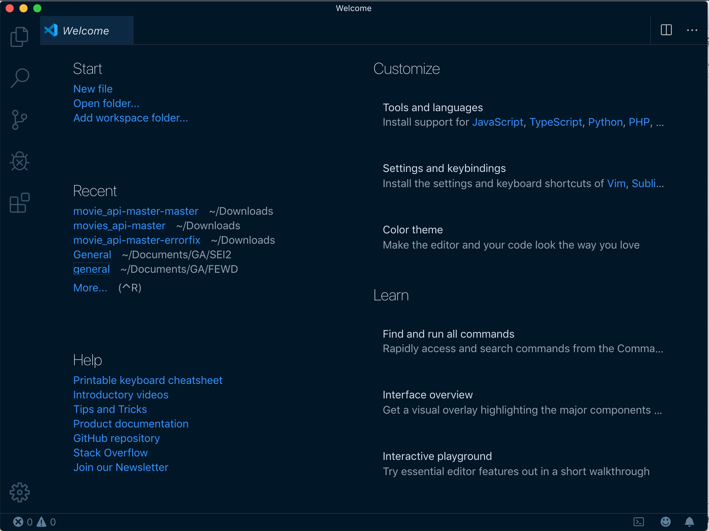

# Java Installfest (Windows)

# Installfest for Windows
## Installing VSCode for Windows

### Four easy steps can do the job for you.

1. Download [Visual Studio Code for Windows](https://code.visualstudio.com/download).
1. Double-click on the downloaded archive to expand the contents.
1. Double-click Visual Studio Code.exe file and follow the installing process till complete.

After installing the VS Code, we can also configure the code to open from a command line, and it is pretty darn easy for us to do that.



1. Launch VS Code.
1. Open the Command Palette (⇧ Shift + Ctrl+ P) and type `shell command` to find the Shell Command: Install `code` command in PATH command.
Now, if you have created any project that goes into that folder and hit the following command to open that project into the Visual Studio Code.

```
code .
```

## Install GIT for windows

## Git & GitHub

- [Create a new account](https://git-invite.generalassemb.ly/invite) to access GitHub Enterprise
- Post the GitHub username you just created into our Slack channel 

### Git for Windows stand-alone installer
1. Download the latest [Git for Windows installer](https://gitforwindows.org/).

1. When you've successfully started the installer, you should see the Git Setup wizard screen. Follow the Next and Finish prompts to complete the installation. The default options are pretty sensible for most users.

1. Open a Command Prompt (or Git Bash if during installation you elected not to use Git from the Windows Command Prompt).

1. Run the following commands to configure your Git username and email using the following commands, replacing Emma's name with your own. These details will be associated with any commits that you create:
```bash
  $ git config --global user.name "Emma Paris"
  $ git config --global user.email "eparis@atlassian.com"
```


### Git Configuration
> You can verify the settings you entered with 
```bash
`git config --list`
```
## Java SE Development Kit 

Run `java -version` on the Windows cmd prompt. If the JDK version is 17.00 or higher, you can skip this step.

[Download and install Java JDK (Version 17)](https://www.oracle.com/bh/java/technologies/downloads/#java17)

## IntelliJ IDEA

[Download and install IntelliJ IDEA Community Edition](https://www.jetbrains.com/idea/download/#section=windows)

Make sure to download the Community edition and not the Ultimate edition.


