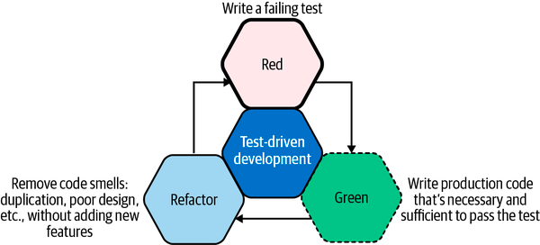
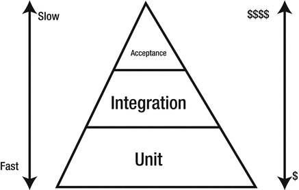
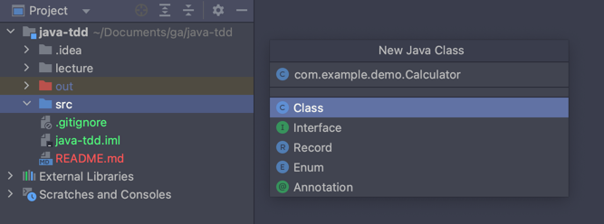
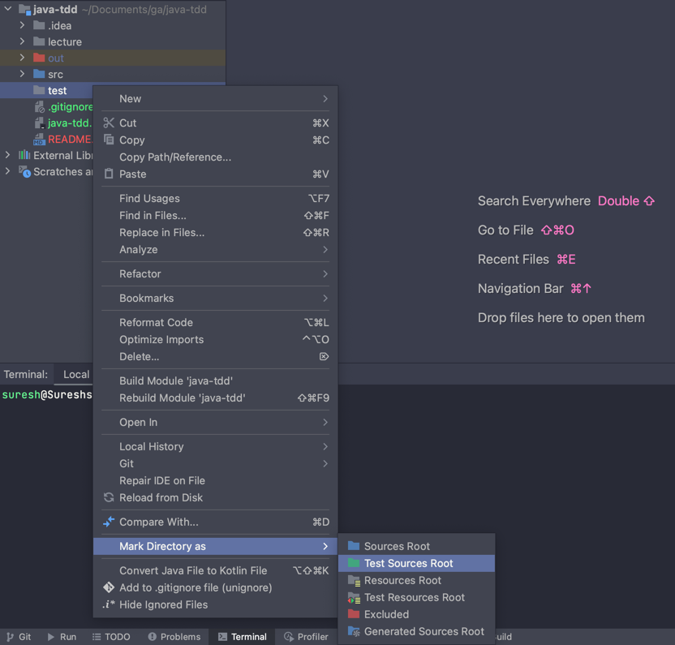
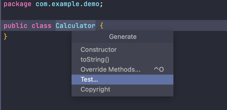
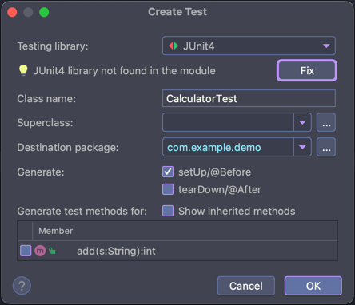
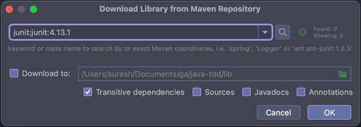
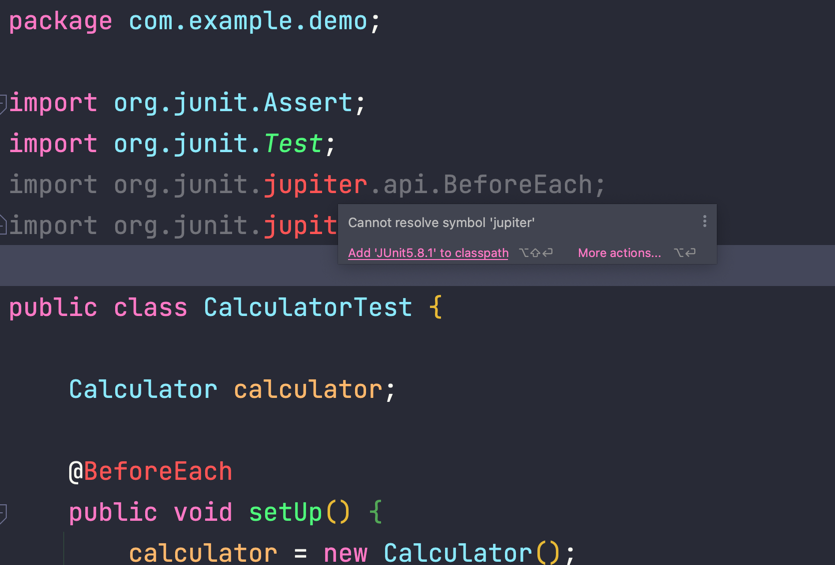

#  Test Driven Development for Java using JUnit

| Title                                        | Type   | Duration | Author               |
|----------------------------------------------|--------|----------|----------------------|
| Test Driven Development for Java using JUnit | Lesson | 4:00     | Suresh Melvin Sigera |

## Learning objectives

**By the end of this lesson, students will be able to:**

- Explain the importance of TDD
- Become familiar with TDD's three phases
- Understand that edge cases are at the limit of the function's behavior


## What is TDD (Test Driven Development)?

Test-driven development follows a three-phase process:

- **Red**. We write a failing test (including possible compilation failures). We run the test suite to verify
  the failing tests.
- **Green**. We write just enough production code to make the test green. We run the test suite to verify
  this.
- **Refactor (Blue)**. We remove any code smells. These may be due to duplication, hardcoded values, or improper use of
  language idioms. If we break any tests during refactoring, we prioritize getting them back to green before exiting
  this phase.



The three phases of this cycle are the essential building blocks of test-driven development.

Note : TDD is a perfect match for the ideals and principles of the Agile Development process, with a great striving to
deliver incremental updates to a product with true quality, as opposed to quantity. The confidence in your individual
units of code that unit testing provides means that you meet this requirement to deliver quality, while eradicating
issues in your production environments.

### Agile Development With Test-Driven Development

TDD comes into its own when **pair programming**, however. The ability to mix up your development workflow, when working
as a pair as you see fit, is nice. For example, one person can write the unit test, see it pass, and then allow the
other developer to write the code to make the test pass.

### Levels of Testing

As you start practicing TDD, you will write different levels of tests. Your application should be composed of tests in
each of the following levels. Each of these levels focuses on a different aspect of code and provides different
feedback. Let's look at them one by one.

- **Unit testing** : Here you est individual software components to verify if the individual unit does the right
  thing in isolation.

- **Integration testing**: Here you test multiple units together to verify if they work correctly as a unit.

- **Acceptance testing**: Here you test the full system to verify if it works as per user expectations. It is often
  referred to as functional testing.



The point image above is to convey that you should have many more unit tests than functional or integration tests.

### Benefits of unit testing

As discussed previously, unit testing is no longer a post-development exercise. It is as equally important as writing
production code and must be done up front. It enhances team productivity by providing solid foundations. Let's look at
the benefits unit testing offers in detail.

**Determines Specifications**

Before we start the journey of coding a component we must try to determine what the component must do? Try to build a
test case of the possible inputs and the possible outputs. The act of building test cases at the start helps to clarify
the expected behavior of the component.

If we are unable to come up with a test, it means that the specifications are not explicit enough and require more
thinking.

**Provides Early Error Detection**

Unit tests are proof of working code. They are executed in every build and can detect failures at the first instance.

Unit tests can detect not only coding bugs but flaws in product specifications as well. A unit test demonstrates
progress; thus, as soon as a component is complete, it can be demo-ed to the stakeholders to find gaps, if any. The
sooner a bug is uncovered, the cheaper it is to fix.

**Supports Maintenance**

Product specifications evolve over time. These changes lead to development cycles. In each of these cycles, the team has
to understand how the existing code works before team members can make any changes. Unit tests help in understanding the
intended behavior without being bogged down by the actual code. A well-written unit test suite serves as a productivity
boost for the team.

**Improves Design**

Unit tests are the first client of the code being tested. They uncover various issues that a client can face while
interfacing with the code being tested. Unit tests make us think in terms of the expected input and the expected output.
For internal components (service, utilities, etc.), this can help in classifying responsibility boundaries. It helps in
improving product specifications by exposing gaps in the interface design.

**Product Documentation**

Unit tests describe how a piece of code works—that is, the expected output for a given input. They always describe the
latest state of a specification, as they are kept in sync with the code changes.

## Characteristics of Good unit tests

Tests should be written with the same focus and clarity as the production code. We must refactor test cases so that `
they are kept lean and correct. Tests will only reap benefits if people can understand and rely on them.

- **Readable**: One of the goals of a test is to educate its reader about what the unit being tested will do. If the
  tests are not readable then the reader will not be able to understand when the tests will fail. A good unit test
  case has a meaningful name so that the reader understands the behavior of unit being tested without looking
  at implementation details.

- **Fast**: Tests should run in few seconds so that they provide quick feedback. If tests take more time, the programmer
  will look for ways to skip the tests. Unit tests must mock external dependencies so that the tests run fast and
  independent of external services. Mocking allows testing of a unit of code by simulating behaviour of its dependencies
  in a controlled manner.

- **Independent and Isolated**: Good unit tests are independent of execution order. They don't rely on other unit tests
  for them to work correctly. They should run independently in their own isolated environment.

- **Correct**: A good unit test does what it says. A test case should correspond to a single case (i.e., behavior).
  Often tests don't do what their name suggests. This is very risky, as in that case you can't trust your
  tests.

- **Environment agnostic**: A litmus test for any software project is the following: "_Can you check out the code
  on a clean developer machine and run the full build including tests without any problem._" Most of the time, we find
  that unit tests fail because they depend on some external factor. The external factor could be a file at a particular
  location, an environment variable, or something else. This leads to brittle tests. A good unit test does not depend on
  the environment.

- **Repeatable**: A good unit test produces the same result each time you run it. Test execution should be automated
  using the build tool. They should be part of the automated build process so that they run each time you execute build.
  When tests start failing randomly, programmers start ignoring them. These random test failures are difficult to
  reproduce and normally happen on external systems like continuous integration servers. Team should ensure
  that failing tests are fixed as soon as they are discovered.

## Syntax for Unit Testing

There is a list of assert statements available on [this page](https://www.baeldung.com/junit-assertions) that you can
use as per your requirements. Below is a list of some of the most common assert statements.

| Method                                                | Checks for                                                                                  |
|-------------------------------------------------------|---------------------------------------------------------------------------------------------|
| `void assertEquals(boolean expected, boolean actual)` | Checks that two primitives/objects are equal                                                |
| `void assertTrue(boolean condition)`                  | Checks that a condition is true                                                             |
| `void assertFalse(boolean condition)`                 | Checks that a condition is false                                                            |
| `void assertNotNull(Object object)`                   | Checks that an object isn't null                                                            | 
| `void assertNull(Object object) `                     | Checks that an object is null                                                               | 
| `void assertSame(object1, object2)`                   | The `assertSame()` method tests if two object references point to the same object           |
| `void assertNotSame(object1, object2)`                | The `assertNotSame()` method tests if two object references do not point to the same object |
| `void assertArrayEquals(expectedArray, resultArray)`  | The `assertArrayEquals()` method will test whether two arrays are equal to each other       |

### Example problem and test driven approach

We are going to take a look at a really simple example to introduce concept of TDD. We will write a very simple
`Calculator` class.

Following a TDD approach, let's say that we have a requirement for an `add` function, which will determine the sum of
two numbers, and return the output. Let's write a failing test for this.

To get started,

1. Right-click the folder `src` in the App root and select New | Java Class.
2. In the popup that opens, name the new package and `Calculator` class: `com.example.demo.Calculator`
   
3. Open the `Calculator.java` in the `src/` directory and add the following contents.
    ```java
    // src/main/tdd/Calculator.java
    
    package com.example.demo;
    
    public class Calculator {
    }
    ```

## Creating a unit test

Create `test` directory in the `java-tdd/` root directory.

Mark the directory as `Test Sources Root`.



Open `Calculator` class, and place the caret somewhere inside the curly braces in the class, `press ⌘ N`.



Select Test Method from the menu. This will create a test method from the default template.

Select `JUnit4` dependency by clicking the `Fix` button.

.

Finally, close the Download Library from Maven Repository dialog box by pressing OK button.



In the package `com.example.demo`, be sure to check whether the `CalculatorTest` class exists.

### Phase 1 (requirement definition)

We will take a simple example of a calculator application, and we will define the requirements based on the basic
features of a calculator. So as said earlier TDD starts with defining requirements in terms of tests. Let's refine our
first requirement in terms of tests.

- Create a simple String calculator with a method `int add(string numbers)`
- The method can take 0, 1 or 2 numbers, and will return their sum (for an empty string it will return `0`) for
  example `“”` or `1` or `1,2`
- Allow the `add` method to handle an unknown amount of numbers

Even though this is a very simple program, just looking at those requirements can be overwhelming. Let’s take a
different approach. Forget what you just read and let us go through the requirements one by one.

#### Requirement 1: The method can take 0, 1 or 2 numbers separated by comma (,).

Let’s write our first set of tests.

```java
package com.example.demo;

import org.junit.Assert;
import org.junit.Before;
import org.junit.Test;
import org.junit.jupiter.api.BeforeEach;
import org.junit.jupiter.api.DisplayName;

public class CalculatorTest {

    Calculator calculator;

    @BeforeEach
    public void setUp() {
        calculator = new Calculator();
    }

    @Test(expected = RuntimeException.class)
    @DisplayName("When more than 2 numbers are used then exception is thrown")
    public final void whenMoreThan2NumbersAreUsedThenExceptionIsThrown() {
        calculator.add("1,2,3");
    }

    @Test
    @DisplayName("when 2 numbers are used then no exception is thrown")
    public final void when2NumbersAreUsedThenNoExceptionIsThrown() {
        calculator.add("1,2");
        Assert.assertTrue(true);
    }

    @Test(expected = RuntimeException.class)
    @DisplayName("when non number is used then exception is thrown")
    public final void whenNonNumberIsUsedThenExceptionIsThrown() {
        calculator.add("1,X");
    }
}
```

**Note**
Here you can see I'm importing `@BeforeEach` and `@DisplayName` annotation, and it is not part of `JUnit4`. You can
install dependency by mouse hovering line 5, and click on Add `JUnit5.x.x` to classpath when dialog box appears.



Keep in mind that the idea behind TDD is to do the necessary minimum to make the tests pass and repeat the process until
the whole functionality is implemented. In this case the name of one of the test methods
is `whenMoreThan2NumbersAreUsedThenExceptionIsThrown`. Our first set of tests verifies that up to two numbers can be
passed to the calculator's add method. If there's more than two or if one of them is not a number, exception should be
thrown. Putting `expected` inside the `@Test` annotation tells the JUnit runner that the expected outcome is to throw
the specified exception.

- The method annotated with `@BeforeEach` runs before each test
- A method annotated with `@Test` defines a test method
- `@DisplayName` can be used to define the name of the test which is displayed to the user
- This is an assert statement which validates that expected and actual value is the same, if not the message at the end
  of the method is shown

```java
public class Calculator {
    public static final void add(final String numbers) {
        String[] numbersArray = numbers.split(",");
        if (numbersArray.length > 2) {
            throw new RuntimeException("Up to 2 numbers separated by comma (,) are allowed");
        } else {
            for (String number : numbersArray) {
                Integer.parseInt(number); // If it is not a number, parseInt will throw an exception
            }
        }
    }
}
```


#### Requirement 2: For an empty string the method will return 0

```java 
  @Test
  @DisplayName("When empty String is used then return value is 0")
  public final void whenEmptyStringIsUsedThenReturnValueIs0(){
        Assert.assertEquals(0,Calculator.add(""));
  }
```

```java
package com.example.demo;

public class Calculator {
    public static int add(final String numbers) {
        String[] numbersArray = numbers.split(",");
        if (numbersArray.length > 2) {
            throw new RuntimeException("Up to 2 numbers separated by comma (,) are allowed");
        } else {
            for (String number : numbersArray) {
                if (!number.isEmpty()) {
                    Integer.parseInt(number);
                }
            }
        }
        return 0; // Added return
    }
}

```

All there was to do to make this test pass was to change the return method from void to int and end it with returning
zero.

#### Requirement 3: Method will return their sum of numbers

```java 
  @Test
  @DisplayName("When one number is used then return value is that same number")
  public final void whenOneNumberIsUsedThenReturnValueIsThatSameNumber(){
        Assert.assertEquals(3,Calculator.add("3"));
  }

  @Test
  @DisplayName("When two numbers are used then return value is their sum")
  public final void whenTwoNumbersAreUsedThenReturnValueIsTheirSum(){
        Assert.assertEquals(3+6,Calculator.add("3,6"));
  }
```

```java
package com.example.demo;

public class Calculator {
    public static int add(final String numbers) {
        int returnValue = 0;
        String[] numbersArray = numbers.split(",");
        if (numbersArray.length > 2) {
            throw new RuntimeException("Up to 2 numbers separated by comma (,) are allowed");
        }
        for (String number : numbersArray) {
            if (!number.trim().isEmpty()) { // after refactoring
                returnValue += Integer.parseInt(number);
            }
        }
        return returnValue;
    }
}
```

Here we added iteration through all numbers to create a sum.

#### You do: Requirement 4: Allow the Add method to handle an unknown amount of numbers (15 min)

- Create `whenAnyNumberOfNumbersIsUsedThenReturnValuesAreTheirSums` method in `CalculatorTest.java`
- Use `Assert.assertEquals(3+6+15+18+46+33, StringCalculator.add("3,6,15,18,46,33"))` to evaluate **modified** add
  method
- Don't forget to comment `whenMoreThan2NumbersAreUsedThenExceptionIsThrown` when testing
  <details>
  <summary>CalculatorTest.java solution</summary>

    ```java 
      //    @Test(expected = RuntimeException.class)
      //    @DisplayName("When more than 2 numbers are used then exception is thrown")
      //    public final void whenMoreThan2NumbersAreUsedThenExceptionIsThrown() {
      //        Calculator.add("1,2,3");
      //    }
  
          @Test
          @DisplayName("when any number of numbers is used then return values are their sums")
          public final void whenAnyNumberOfNumbersIsUsedThenReturnValuesAreTheirSums() {
              Assert.assertEquals(3 + 6 + 15 + 18 + 46 + 33, Calculator.add("3,6,15,18,46,33"));
          }
    ```
  </details>
  <details>
  <summary>Calculator.java solution</summary>

    ```java
    package com.example.demo;
  
    public class Calculator {
      public static int add(final String numbers) {
        int returnValue = 0;
        String[] numbersArray = numbers.split(",");
        // removed after exception
        // if (numbersArray.length > 2) {
        // throw new RuntimeException("Up to 2 numbers separated by comma (,) are allowed");
        // }
        for (String number : numbersArray) {
          if (!number.trim().isEmpty()) { // After refactoring
            returnValue += Integer.parseInt(number);
          }
        }
        return returnValue;
      }
    }
    ```

  All we had to do to accomplish this requirement was to remove part of the code that throws an exception if there are
  more than 2 numbers. However, once tests are executed, the first test failed. In order to fulfill this requirement,
  the test `whenMoreThan2NumbersAreUsedThenExceptionIsThrown` needed to be removed.

  </details>

<!-- #### Requirement 5: Allow the Add method to handle new lines between numbers (instead of commas).

```java 
    @Test
    @DisplayName("When new line is used between numbers then return values is their sum")
    public final void whenNewLineIsUsedBetweenNumbersThenReturnValuesIsTheirSums(){
        Assert.assertEquals(3+6+15,Calculator.add("3,6n15"));
    }
```

```java
public class Calculator {
    public static int add(final String numbers) {
        int returnValue = 0;
        String[] numbersArray = numbers.split(",|n"); // added |n to the split regex
        for (String number : numbersArray) {
            if (!number.trim().isEmpty()) {
                returnValue += Integer.parseInt(number.trim());
            }
        }
        return returnValue;
    }
}
```

All we had to do to was to extend the split regex by adding `|\n`.

#### Requirement 6: Support different delimiters

```java 
    @Test
    @DisplayName("When delimiter is specified then it is used to separate numbers")
    public final void whenDelimiterIsSpecifiedThenItIsUsedToSeparateNumbers() {
        Assert.assertEquals(3 + 6 + 15, Calculator.add("//;n3;6;15"));
    }
```

```java
package com.example.demo;

public class Calculator {

    public static int add(final String numbers) {
        String delimiter = ",|n";
        String numbersWithoutDelimiter = numbers;
        if (numbers.startsWith("//")) {
            int delimiterIndex = numbers.indexOf("//") + 2;
            delimiter = numbers.substring(delimiterIndex, delimiterIndex + 1);
            numbersWithoutDelimiter = numbers.substring(numbers.indexOf("n") + 1);
        }
        return add(numbersWithoutDelimiter, delimiter);
    }

    private static int add(final String numbers, final String delimiter) {
        int returnValue = 0;
        String[] numbersArray = numbers.split(delimiter);
        for (String number : numbersArray) {
            if (!number.trim().isEmpty()) {
                returnValue += Integer.parseInt(number.trim());
            }
        }
        return returnValue;
    }
}
```

This time there was quite a lot of refactoring. We split the code into 2 methods. Initial method parses the input
looking for the delimiter and later on calls the new one that does the actual sum. Since we already have tests that
cover all existing functionality, it was safe to do the refactoring. If anything went wrong, one of the tests would find
the problem.

#### Requirement 7: Negative numbers will throw an exception

Calling Add with a negative number will throw an exception **negatives not allowed** – and the negative that was passed.
If there are multiple negatives, show all of them in the exception message.

```java 
    @Test(expected = RuntimeException.class)
    @DisplayName("When negative number is used then runtime exception is thrown")
    public final void whenNegativeNumberIsUsedThenRuntimeExceptionIsThrown() {
        Calculator.add("3,-6,15,18,46,33");
    }

    @Test
    @DisplayName("When negative numbers is used then runtime exception is thrown")
    public final void whenNegativeNumbersAreUsedThenRuntimeExceptionIsThrown() {
        RuntimeException exception = null;
        try {
            Calculator.add("3,-6,15,-18,46,33");
        } catch (RuntimeException e) {
            exception = e;
        }
        Assert.assertNotNull(exception);
        Assert.assertEquals("Negatives not allowed: [-6, -18]", exception.getMessage());
    }
```

There are two new tests. First one checks whether exception is thrown when there are negative numbers. The second one
verifies whether the exception message is correct.

```java 
      private static int add(final String numbers, final String delimiter) {
          int returnValue = 0;
          String[] numbersArray = numbers.split(delimiter);
          List<Integer> negativeNumbers = new ArrayList<Integer>();
          for (String number : numbersArray) {
              if (!number.trim().isEmpty()) {
                  int numberInt = Integer.parseInt(number.trim());
                  if (numberInt < 0) {
                      negativeNumbers.add(numberInt);
                  }
                  returnValue += numberInt;
              }
          }
          if (negativeNumbers.size() > 0) {
              throw new RuntimeException("Negatives not allowed: " + negativeNumbers.toString());
          }
          return returnValue;
      }
```

This time code was added that collects negative numbers in a List and throws an exception if there was any.

**Note** :- In order to `whenNewLineIsUsedBetweenNumbersThenReturnValuesIsTheirSums`
and `whenDelimiterIsSpecifiedThenItIsUsedToSeparateNumbers` pass you need to modify the assert statements like so :

```java 
    @Test
    @DisplayName("When new line is used between numbers then return values is their sum")
    public final void whenNewLineIsUsedBetweenNumbersThenReturnValuesIsTheirSums() {
        Assert.assertEquals(3 + 6 + 15, Calculator.add("3,6\n15"));
    }

    @Test
    @DisplayName("When delimiter is specified then it is used to separate numbers")
    public final void whenDelimiterIsSpecifiedThenItIsUsedToSeparateNumbers() {
        Assert.assertEquals(3 + 6 + 15, Calculator.add("//;\n3;6;15"));
    }
```

#### Requirement 8: Numbers bigger than 1000 should be ignored

Example: adding `2 + 1001 = 2`

```java 
    @Test
    @DisplayName("When one or more numbers are greater than 1000 is used then it is not included in sum")
    public final void whenOneOrMoreNumbersAreGreaterThan1000IsUsedThenItIsNotIncludedInSum() {
        Assert.assertEquals(3 + 1000 + 6, Calculator.add("3,1000,1001,6,1234"));
    }
```

```java 
    private static int add(final String numbers, final String delimiter) {
        int returnValue = 0;
        String[] numbersArray = numbers.split(delimiter);
        List<Integer> negativeNumbers = new ArrayList<Integer>();
        for (String number : numbersArray) {
            if (!number.trim().isEmpty()) {
                int numberInt = Integer.parseInt(number.trim());
                if (numberInt < 0) {
                    negativeNumbers.add(numberInt);
                } else if (numberInt <= 1000) {
                    returnValue += numberInt;
                }
            }
        }
        if (negativeNumbers.size() > 0) {
            throw new RuntimeException("Negatives not allowed: " + negativeNumbers.toString());
        }
        return returnValue;
    }
```

This one was simple. We moved `returnValue += numberInt;` inside an `else if (numberInt <= 1000)`. -->

## Summary

TDD doesn't exist without a **clean** approach because it minimizes the number of bug errors and duplicates. TDD
involves moving in small steps and comparing the expected results with reality in the context of the **Red** >
**Green** >**Refactoring** process. **Throws** error handling chains are among **Clean Code** practices. One may
transition from one test to another only after receiving a positive result in **Refactoring**. By-products or methods at
the **Green** >**Refactoring** stage may indicate which methods and qualities need to be encapsulated or removed
completely.

It is the efficiency of TDD that cuts its costs:

- This process decreases the time needed to launch and build the project, especially during cold starts
- Tests change before changing the functionality which allows them to perform better
- TDD brings down your stress levels
- This approach supports the project legacy while simplifying writing tests
- It is easier to study architecture in tests because they better indicate the ownership of objects
- TDD its a part of software development automation
- Finally, the code is cleaner

## Further Reading

This section provides more resources on the topic if you are looking to go deeper.

- [What is Test Driven Development? - Agile Alliance](https://www.agilealliance.org/glossary/tdd/)
- [Test Driven Development - Approach & Benefits](https://www.browserstack.com/guide/what-is-test-driven-development)
- [Pair Programming & Test Driven Development Done Right](https://www.youtube.com/watch?v=CLfT1fH-38A)
