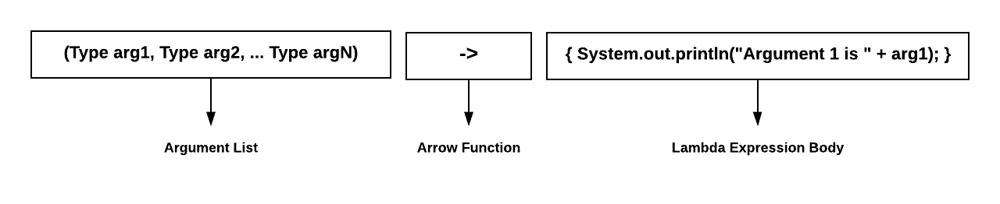

|                     Title                    |  Type  | Duration |  Creator |
|:-------------------------------------------:|:------:|:--------:|:--------:|
| Functional Programming: Lambda Expressions | Lesson |   3:00   | Kyle Dye |


#  Functional Programming: Lambdas & Streams

### Learning Objectives

At the end of this lesson, students will be able to:
* Explain how lambda expressions and streams improve code readability.
* Use lambda expressions to significantly decrease the amount of code needed to accomplish a task.
* Create a lambda expression with streams.

---

### Lesson Guide

| Timing |         Type         |                                           Topic                                          |
|:------:|:--------------------:|:----------------------------------------------------------------------------------------:|
| 10 min |     Introduction     |                         Lambda Expression Syntax                                         |
| 10 min |         Demo         |   To Lambda or Not to Lambda, That Is the Question                                       |
| 10 min |     Introduction     |                          Streams and Collections                   |
| 10 min |         Demo         |                 Iterating Through a Collection Using Streams                    |
| 10 min |     Introduction     |              `map()` and `collect()`                        |
| 10 min |         Demo         | Rewrite Previous Demo Using Collectors |
| 10 min |     Introduction     |                                      The `filter()` Method                                     |
| 20 min | Independent Practice | Complete a Program Using Streams, Lambda Expressions, Filtering, and Collecting |
|  5 min |      Conclusion      |                                       Review/Recap                                       |

## Lambda Expression Syntax (10 min)



A **lambda expression** is an anonymous function with a concise functional syntax that's used for writing anonymous methods. *Lambda expressions basically express instances of functional interfaces* (An interface with single abstract method is called functional interface. An example is java.lang.Runnable).

Lambda expressions are similar to anonymous classes in that they enable you to express functionality as data — for example, to pass functionality into a method as a parameter. But where anonymous classes require a lot of boilerplate code to set up the class, lambda expressions provide a concise syntax specifically for expressing code as data.

A lambda expression consists of the following:
- A comma-separated collection of formal parameters enclosed in parentheses.
- Followed by an arrow `->`.
- Followed by the body, consisting of either a single expression or a statement block.

You may — but are not required to — specify the data type of the parameters in a lambda expression, and where there's no ambiguity, they're usually omitted for brevity. Additionally, you may omit the parentheses around the parameter list, provided there's exactly one parameter. 

Finally, if the body consists of more than one statement, it must be enclosed in curly braces. However, if it consists of exactly one statement, the braces may be omitted, in which case the `return` keyword must also be omitted, as well as the semicolon at the end of the lambda expression.

**Example:**

    (int a, int b) -> { return a * b; }
    
The example above has two `int` parameters: `a` and `b`. The expression body will multiply the `int` parameter `a` with the `int` parameter `b`.

In this example, the type `int` is usually optional (depending on context) and can be expressed as:  

    (a, b) -> { return a * b; }  
    
Because it's a one-statement lambda, we can also drop the brackets, `return`, and semicolon:

    (a, b) -> a * b  
    
-----    

## Demo: To Lambda or Not to Lambda, That Is the Question (10 min)

In the following demo, we'll create a `Computation` interface and use it to solve simple math problems. We'll create two versions of the demo: one without lambda expressions and one with lambda expressions.

**Example without lambda expressions:**

```java    
package com.ga.examples;

public class NonLambdaExpressionIntroDemo {

    // Here's the Computation interface:
    interface Computation {
        int operation(int a, int b);
    }

    public static void main(String[] args) {

        // Notice the use of the anonymous inner class:
        Computation add = new Computation() {

            @Override
            public int operation(int a, int b) {
                return a + b;
            }
        };

        System.out.println("5 + 6 = " + add.operation(5, 6));

        // Notice the use of yet another anonymous inner class:
        Computation subtract = new Computation() {

            @Override
            public int operation(int a, int b) {
                return a - b;
            }
        };

        System.out.println("10 - 6 = " + subtract.operation(10, 6));

    }
}
```
>`Computation` is an example of nested or inner interface. It can be written in both class or interface. A nested interface can only be called by using outer class or outer interface name followed by dot( . ), followed by the interface name.

The output will be the following:

- `5 + 6 = 11`
- `10 - 6 = 4`

**Example with lambda expressions:**

```java
package com.ga.examples;

public class LambdaExpressionIntroDemo {

    interface Computation {
        int operation(int a, int b);
    }

    public static void main(String[] args) {

        Computation add = (a, b) -> a + b;

        System.out.println("5 + 6 = " + add.operation(5, 6));

        Computation subtract = (a, b) -> a - b;

        System.out.println("10 - 6 = " + subtract.operation(10, 6));
    }
}
```

Notice the reduction in the amount of code necessary to perform the computation:

- **Example 1**: 680 characters and 32 lines  
- **Example 2**: 416 characters and 19 lines  

This is a 39% reduction in characters and a 41% reduction in lines of code. Also, in most cases, code that uses lambdas becomes more expressive and more readable.

Let's take a look at some more examples of lambda expressions. The next one has the following functional interface:

```java
interface HelloYou {
    void greetYou(String name);
}
```

If you notice, the `greetYou()` method takes in one parameter (`name`) and has a `void` return type. The following code implements this method with the lambda on Line 1:

```java
HelloYou helloYou = name -> System.out.println("Hello " + name);
helloYou.greetYou("Michael"); // => Hello Michael
```

You'll notice that the lambda has one parameter, so you can omit the parentheses. The parameter also corresponds to the single input parameter for the `greetYou`() method. The `println()` method in the lambda body has a `void` return type, which corresponds to the return type of the `greetYou()` method.

This next example has the following functional interface:

```java
 interface Greeting {
    void greet();
}
```

The `greet()` method has no input parameters and has a `void` return type. The following code shows how to implement this with a lambda expression (Line 1):

```java
Greeting greeting = () -> System.out.println("Hello whoever you are!");
greeting.greet(); // => Hello whoever you are!
```  

To represent the empty parameter for the `greet()` method, you'd use `()`. The `println()` method has a `void` return type, which corresponds to the return type of the `greet()` method.

------

## Streams and Collections (10 min)

### What Is a Stream?

A **collection** is a data structure that stores elements, while a **stream** is a sequence of elements that moves values from a source — such as a collection — through a pipeline of steps. Stream operations leverage lambda expressions to produce a result, as we'll see shortly.

### What Is a Pipeline?

A **pipeline** is a sequence of operations — such as filtering, modifying, or aggregating — that are applied to a source stream to produce a result. The result can be anything: a primitive, an object, a collection, or even another stream. The operations are supplied as parameters, expressed as lambda expressions. Some common stream operations are `map()`, `filter()`, `sum()`, `average()`, `sort()`, and `forEach()`.

### Types of Stream Operations

Stream operations are used to modify streams to create an end result. They come in two major flavors:  
- **Intermediate operations** take a stream as input, filtering and modifying the input elements to produce a new stream as output. Some commonly used intermediate operations are `map()`, `filter()`, `sort()`, and `flatMap()`. 
- **Terminal operations** consume a stream to produce a final result. Once a terminal operation is reached, the stream is fully consumed and no further operations can be applied to it. Some common terminal operations are `collect()`, `reduce()`, and `forEach()`.

### Getting a Stream From a Collection

Let's say we have the following list:

```java
List<String> stringList = Arrays.asList("Hello", "World");
```

To generate a stream from the list, we say:

```java
Stream stream = stringList.stream();
```

To print out the elements of the `stringList` collection using a stream, we could do the following:

```java
stringList.stream().forEach(stringValue -> {
    System.out.println(stringValue);
});
```

Or even simpler:

```java
stringList.forEach(x -> System.out.println(x));
```

We can use the `forEach()` operator directly on the list, because Java collections have a built-in `forEach()` method, which implicitly calls `stream().forEach()`.

The output would be:

`Hello`  
`World`

-----

## Demo: Iterating Through a Collection Using Streams (10 min)

In this demo, we'll take an existing list of `String` objects and iterate through it to produce a new list of strings, consisting of the values from the original list concatenated with a constant `String` value.

```java
package com.ga.examples;

import java.util.ArrayList;
import java.util.Arrays;
import java.util.List;

public class ListIterationWithConcatenationDemo {

    public static void main(String[] args) {
        // The original list
        List<String> stringList = Arrays.asList("My name is ", "My friends call me ", "My mother calls me ");
        List<String> concatenatedList = new ArrayList<>();

        stringList.forEach(stringValue -> concatenatedList.add(stringValue + "Jim");

        // Output the values of the concatenated list using streams.
        concatenatedList.forEach(stringValue -> System.out.println(stringValue));

        // Output the values of the original list using streams to show that the list is unaltered.
        stringList.forEach(stringValue -> System.out.println(stringValue));
    }
}
```
    
The output would be:  

`My name is Jim`  
`My friends call me Jim`  
`My mother calls me Jim`  
`My name is`  
`My friends call me`  
`My mother calls me`


When using streams, the original list is unaltered.

> **Knowledge Check**: How many lambda expressions are in the demo?

-----

## The `filter()` Method (10 min)

What if we have a requirement where we only need a subset of the data based on certain criteria? This is where the intermediate operation `filter()` comes in.

### What Is the `filter()` Method?

The `filter()` method essentially selects a subset of elements from the original list based on a "predicate" condition expressed as a lambda. The `filter()` method accepts a `Predicate` object, which provides a function applied to a condition. If the condition evaluates to `true`, the object is selected. Otherwise, it's ignored.

We'll see in the "Functional Interfaces" lesson that the lambda is used to express the `Predicate` functional interface by taking an input value and producing a Boolean result.  

**Example:**

```java
List<Integer> numberList = Arrays.asList(1, 2, 3, 4, 5, 6, 7, 8, 9, 10);

// We want to create a list of only the even numbers.
List<Integer> evenNumberList =
    numberList.stream()
        .filter(number -> number % 2 == 0)
        .collect(Collectors.toList());

evenNumberList.forEach(number -> System.out.println(number));
```

In this example, we use a lambda expression in the `filter()` method to express this condition: "If the number is even, return `true` and keep it. Otherwise, return `false` and ignore it."

The output would be:  

`2`  
`4`  
`6`  
`8`  
`10`  

---

## Stream Processing Doesn't Start Until We Have a Terminal Stream Operation (10 min)

### What Does the `map()` Function Do?  

The `map()` intermediate operation is a method in the `Stream` class that represents a functional programming concept. `map()` is used to transform one object into a different object by using a lambda expression.

**Syntax:**  

`.map(argument -> function to apply)`

> Notice the lambda expression in the syntax above.

**Example:**  
    
```java
List<String> numbersList = Arrays.asList("1", "2", "3", "4", "5");

Stream<Integer> numberListStream =
    numbersList.stream()
        .map(number -> Integer.valueOf(number));
```

In the example above, we're iterating through the list and, for each value, the `number` argument represents the next number in the list. The `Integer.valueOf(number)` function is applied to each of those `number` values in turn, producing a new stream of `Integer` values that can be further filtered, aggregated, and converted to other objects.

> **Note**: The `map()` function will always return a stream because it's an intermediate operation.

### What Are Collectors?

In the previous examples, we've seen how to iterate through streams and how to map streams to new objects to produce new streams. But at the end of the day, we want values — not streams. So, how do you come up with an end result? That's where collectors come in.

**Collectors** are terminal operators used to implement various reduction operations, such as accumulating elements into collections, summarizing elements according to various criteria, and more. In short, collectors produce an end result from an input stream.

Java provides a `Collectors` class with many static methods. Let's zoom in on one of these methods — `toList()` — which we'll use to expand our earlier example by consuming a stream of `String` objects that represents integers to produce a new list of corresponding `Integer` values:

```java
List<String> numbersList = Arrays.asList("1", "2", "3", "4", "5");

List<Integer> newNumbersList =
    numbersList.stream()
        .map(number -> Integer.valueOf(number))
        .collect(Collectors.toList());
```

The `map()` operation converts each `String` from the input stream into an `Integer`, producing a new list of `Integer` values.
 
The `collect()` operation consumes the resulting `Integer` stream and produces a list of corresponding `Integer` objects.
 
> **A side note on how intermediate operators are evaluated**: Intermediate operators such as `map()` are lazy in nature. This means they don't execute until a terminal operator is encountered. In the case of the code above, the `map()` logic won't execute until `collect()` is encountered.

----

#### Rewrite Previous Demo Using Collectors (10 min)

For this demo, we'll revisit `My name is Jim` from before, but this time we'll use a collector instead of manually adding elements to a new list.

```java
package com.ga.examples;

import java.util.ArrayList;
import java.util.Arrays;
import java.util.List;
import java.util.stream.Collectors;

public class MapWithConcatenationDemo {

    public static void main(String[] args) {

        List<String> stringList = Arrays.asList("My name is ", "My friends call me ", "My mother calls me ");

        List<String> concatenatedList =
            stringList.stream()
                .map(stringValue -> stringValue + "Jim")
                .collect(Collectors.toList());

        // Output the values of the concatenated list using streams.
        concatenatedList.stream().forEach(stringValue -> System.out.println(stringValue));

        // Output the values of the original list using streams to show that the list is unaltered.
        stringList.stream().forEach(stringValue -> System.out.println(stringValue));
    }
}
```

The output would be:  

`My name is Jim`  
`My friends call me Jim`  
`My mother calls me Jim`  
`My name is`  
`My friends call me`  
`My mother calls me` 

<!--**Instructor Notes:**
- Point out to the class that the code is more concise and readable when using collectors.
- Also, point out the stream pipeline of `stringList.stream()`, `map()`, and `collect()`.-->

-----

## Independent Practice (20 min)

For this independent practice, we'll take the template program below and complete the `TODO` parts commented out. To confirm that your results are correct, iterate through each list you create and output the results.

**Hints:**  
- You'll need to leverage the intermediate operations `map()` and `filter()`.
- You'll also need to use the terminal operation `Collectors.toList`.

### Independent Practice Template

Create a Person class as given below,

```java
package com.ga.demo.stream;

class Person {

    private String name;
    private int age;

    public Person(String name, int age) {
        this.name = name;
        this.age = age;
    }

    public String getName() {
        return name;
    }

    public void setName(String name) {
        this.name = name;
    }

    public int getAge() {
        return age;
    }

    public void setAge(int age) {
        this.age = age;
    }

    @Override
    public String toString() {
        return "Person {" +
                "name = '" + name + '\'' +
                ", age = " + age +
                '}';
    }
}
```

Now create `Main` class with a `main()` method and replace commented lines with the code

```java
package com.ga.examples;

import java.util.Arrays;
import java.util.List;

public class IndependentPractice1 {

    public static void main(String[] args) {

        List<Person> personList = createPersonList();

        // TODO: Create a list of Person objects whose names start with the letter "M".

        // TODO: Create a list of Strings containing the names of persons over the age of 40.

        // TODO: Create a list of Person objects whose names start with the letter "J" and are under the age of 47.
        
    }

    private static List<Person> createPersonList() {

        return Arrays.asList(
            new Person("Mark", 45),
            new Person("Henry", 30),
            new Person("John", 18),
            new Person("Morgan", 6),
            new Person("Amanda", 23),
            new Person("Tiffany", 60),
            new Person("Jim", 50),
            new Person("Janet", 45)
        );
    }
}
```

The completed example can be found in the repo in the file named [IndependentPractice1Completed.java](./src/com/ga/examples/IndependentPractice1Completed.java).

----

### Other Commonly Used Intermediate Stream Operations (15 min)

#### `flatmap()`

`flatmap()` is used to combine (or "flatten") multiple incoming streams into a single stream. The flatMap() method allows avoiding nested Stream<Stream<R>> structure.

The following example will flatten a list of `Person` lists (i.e., `List<List<Person>>`) into just a `Person` list (i.e., `List<Person>`):

```
    List<Person> personList1 =
            Arrays.asList(
                    new Person("Tom", 30),
                    new Person("Jeff", 70));

    List<Person> personList2 =
            Arrays.asList(
                    new Person("Jane", 45),
                    new Person("Alice", 38));
    
    // Create a list of lists, containing both of our Person lists above.
    List<List<Person>> listOfPersonLists = Arrays.asList(personList1, personList2);

    // flatMap(): Flatten the list of person lists.
    List<Person> flatPersonList =
            listOfPersonLists.stream()
                .flatMap(Collection::stream) // Convert each list into a stream, then flatten them all into a single stream.
                .collect(Collectors.toList());
    
    flatPersonList.forEach(person -> System.out.println(person));
```
> Method reference using `::` is a convenience operator. For example `A::B` refers method B in class A

The output is:  

`Person {name='Tom', age=30}`  
`Person {name='Jeff', age=70}`  
`Person {name='Jane', age=45}`  
`Person {name='Alice', age=38}`  

> The `Collection::stream` line basically says, "Take the list streams from both lists and merge them."

`map()` works pretty well in a simple list case. But what if we have something more complex such as a list of lists as an input, then `flatMap()` works better.

#### `sorted()`

`sorted()` is used to sort elements in a stream based on a given comparison.

The following example will sort the `Person` list alphabetically by name:

    // sorted: sort the person list alphabetically
    List<Person> sortedList =
            personList.stream()
            .sorted((person1, person2) -> person1.getName().compareTo(person2.getName()))
            .collect(Collectors.toList());
    
    sortedList.forEach(person -> System.out.println(person));

The output is:  

`Person {name='Jane', age=45}`  
`Person {name='Jeff', age=70}`  
`Person {name='Tom', age=30}`  

---

### Why Ordering Matters With Intermediate Operations (10 min)   

The last example for this demo will show you how ordering your intermediate operations improperly can cause unnecessary processing.

Take a look at the following example:

    List<Person> largePersonList =
        Arrays.asList(
                new Person("Tom", 30),
                new Person("John", 29),
                new Person("Jenny", 20),
                new Person("Mark", 35),
                new Person("Chris", 37),
                new Person("Paige", 31),
                new Person("Helen", 60),
                new Person("Erin", 50),
                new Person("Zach", 10),
                new Person("Jane", 45),
                new Person("Jeff", 70));

    List<Person> sortedAndFilteredList =
        largePersonList.stream()
            .sorted((person1, person2) -> person1.getName().compareTo(person2.getName()))
            .filter(person -> person.getAge() > 31)
            .filter(person -> person.getName().startsWith("J"))
            .collect(Collectors.toList());

    sortedAndFilteredList.forEach(person -> System.out.println(person));

The output is:  

`Person {name='Jane', age=45}`  
`Person {name='Jeff', age=70}`  

If you notice, we did the sorting first, followed by the filtering. The `sorted()` operation has to look through all 11 `Person` objects. Then, the `filter()` operation has to again look through all 11 `Person` objects. The last `filter()` operation has to look through six `Person` objects due to the previous age filter. That's 28 total iterations, including a relatively large sorting of 11 items.

> **Knowledge Check**: What if we reordered the intermediate stream operations in the pipeline by putting the filters before the sort? Which filter should be first?

I would say to pick the filter that produces the least number of results. So, which filter would that be?

The age `filter()` returns six results, whereas the name `filter()` returns four. Let's redo the example and see how many total iterations it will be after reordering:

    List<Person> filteredAndSortedList =
        largePersonList.stream()
            .filter(person -> person.getName().startsWith("J"))
            .filter(person -> person.getAge() > 31)
            .sorted((person1, person2) -> person1.getName().compareTo(person2.getName()))
            .collect(Collectors.toList());

    filteredAndSortedList.forEach(person -> System.out.println(person));


The output is:  

`Person {name='Jane', age=45}`  
`Person {name='Jeff', age=70}`  

The first name `filter()` takes 11 iterations to filter the stream down to four. The age `filter()` takes four iterations to filter the stream down to two `Person` objects. Lastly, you have to sort those two `Person` objects in the stream. That's a total of 17 iterations, including a small sort of just two items. We've cut out 11 unnecessary iterations and changed a long sort into a short one, just by reordering the pipeline. The moral of the story: Filter first.

-----

### Other Terminal Stream Operations (10 min)

As we mentioned in the last functional programming module, terminal operations such as `forEach()` mark the stream as consumed, after which it can no longer be used.  

Some commonly used terminal stream operations are:  
- `findFirst()`: Returns the first entry in a stream.
- `collect()`: Repackages the elements from the stream into another data structure such as a `List` or `Map`.
- `toArray()`: Converts the stream to an array.

We'll discuss several other useful terminal operations in the "Comparison-Based Stream Operations" section.

### Demo: Terminal Stream Operations  

For this short demo, we'll show examples of using `findFirst()`, `collect()`, and `toArray()`. We'll also use the same `Person` class in the previous demo:

    public class Person {

        private String name;
        private int age;

        public Person(String name, int age) {
            this.name = name;
            this.age = age;
        }

        public String getName() {
            return name;
        }

        public void setName(String name) {
            this.name = name;
        }

        public int getAge() {
            return age;
        }

        public void setAge(int age) {
            this.age = age;
        }

        @Override
        public String toString() {
            return "Person {" +
                    "name='" + name + '\'' +
                    ", age=" + age +
                    '}';
        }
    }

### `findFirst()`

Find the first person over the age of 35:

    Person personOverThirtyFive =
        largePersonList.stream()
            .filter(person -> person.getAge() > 35)
            .findFirst()
            .orElse(null);

    System.out.println(personOverThirtyFive);

The output is:  

`Person {name='Chris', age=37}`

**Note**: Some stream operations such as `min()`, `max()`, and `findFirst()` return an instance of the `Optional` class. This will be covered in detail in another module, but for now, `Optional` is a data structure that must contain exactly one value or no value. If no value, the `Optional.orElse()` method returns the supplied value — in this case, `null`. If one, `orElse` returns that value.

So, in the example, if no result is found, it will return `null`. However, we did find a result.

### `toArray()`

Create an array from `largePersonList`:

    Person[] personArray =
        personList.toArray(new Person[personList.size()]);

    System.out.println(personArray[0]);
    System.out.println(personArray[1]);
    System.out.println(personArray[2]);
    System.out.println(personArray[3]);
    System.out.println(personArray[4]);
    System.out.println(personArray[5]);
    System.out.println(personArray[6]);
    System.out.println(personArray[7]);
    System.out.println(personArray[8]);
    System.out.println(personArray[9]);
    System.out.println(personArray[10]);

The output is:  

`Person {name='Tom', age=30}`  
`Person{name='John', age=29}`  
`Person{name='Jenny', age=20}`  
`Person{name='Mark', age=35}`  
`Person{name='Chris', age=37}`  
`Person{name='Paige', age=31}`  
`Person{name='Helen', age=60}`  
`Person{name='Erin', age=50}`  
`Person{name='Zach', age=10}`  
`Person{name='Jane', age=45}`  
`Person{name='Jeff', age=70}`

`toArray()` is a convenient method on List collection that returns the elements of the collection as an array.

-----

## More Collectors (15 min)

In the previous module, we talked briefly about collectors. Again, collectors are used to collect data out of a stream and put it into a data structure. In this section, we'll look at other data structures to which we can output. They are:  

- `toSet()`: Similar to `toList()` but returns a `Set` (which is an unordered collection of unique elements).
- `toMap()`: Creates a `Map` of key-value pairs.
- `groupingBy()`: Allows you to partition a stream into groups. Each key can have **one or more** values (a `Collection`).

### Demo: More Collectors

We'll use the same `Person` class in some examples:

    public static class Person {

        private String name;
        private int age;

        public Person(String name, int age) {
            this.name = name;
            this.age = age;
        }

        public String getName() {
            return name;
        }

        public void setName(String name) {
            this.name = name;
        }

        public int getAge() {
            return age;
        }

        public void setAge(int age) {
            this.age = age;
        }

        @Override
        public String toString() {
            return "Person {" +
                    "name='" + name + '\'' +
                    ", age=" + age +
                    '}';
        }

        @Override
        public boolean equals(Object o) {
            if (this == o) return true;
            
            if (!(o instanceof Person)) return false;
            
            Person person = (Person) o;
            
            return age == person.age &&
                    Objects.equals(name, person.name);
        }

        @Override
        public int hashCode() {
            return Objects.hash(name, age);
        }
    }

### `toSet()`

The example below will take a list that contains one duplicate and create a `Set` that discards the duplicates. Like usual, duplicates are defined as values that return `true` when compared using the `equals()` method:

    List<CollectorsDemo.Person> duplicatePersonList =
        Arrays.asList(
                new CollectorsDemo.Person("Tom", 30),
                new CollectorsDemo.Person("Tom", 30),
                new CollectorsDemo.Person("Jenny", 20));
                
    Set<Person> personSet =
        duplicatePersonList.stream()
            .collect(Collectors.toSet());

    personSet.stream().forEach(person -> System.out.println(person));

The output is:  

`Person {name='Tom', age=30}`  
`Person {name='Jenny', age=20}`  

### `toMap()`

The example below will create a `Map`, where the key is the person's name and the value is the age:
    
    Map<String, Integer> nameToAgeMap =
        largePersonList.stream()
            .collect(Collectors.toMap(person -> person.getName(), person -> person.getAge()));

    nameToAgeMap.forEach((key, value) -> System.out.println("Name is " + key + " and age is " + value));

Notice that each entry in the `Map` contains **one** `String` key and **one** `Integer` value. Two lambdas are used for each element: one to define the key and the second to define the value.

The output is: 

`Name is Erin and age is 50`  
`Name is Paige and age is 31`  
`Name is Tom and age is 30`  
`Name is Zach and age is 10`  
`Name is Chris and age is 37`  
`Name is Jeff and age is 70`  
`Name is John and age is 29`  
`Name is Mark and age is 35`  
`Name is Jenny and age is 20`  
`Name is Jane and age is 45`  
`Name is Helen and age is 60`  
`Name is Tom and age is 30`  
`Name is Jenny and age is 20`  

### A Special Note About `toMap()` and Duplicate Keys

If `toMap()` encounters a duplicate key, then an exception will be thrown. For example:  

    Map<String, Integer> nameToAgeDuplicateMap =
        duplicatePersonList.stream()
                .collect(Collectors
                        .toMap(person -> person.getName(),
                                person -> person.getAge()));

The output is:  

`Exception in thread "main" java.lang.IllegalStateException: Duplicate key 30`  

You can avoid this by passing a lambda expression as the third argument to `toMap()`, which will define the value to use when a duplicate is encountered. For example:

    Map<String, Integer> nameToAgeDuplicateMap =
            duplicatePersonList.stream()
                    .collect(Collectors
                            .toMap(person -> person.getName(),
                                    person -> person.getAge(),
                                    (first, second) -> second));

    nameToAgeDuplicateMap.forEach((key, value) -> System.out.println("Name is " + key + " and age is " + value));

The output is:  

`Name is Tom and age is 30`  
`Name is Jenny and age is 20`  

If you look at the lambda expression that's provided to `toMap()`:

    (first, second) -> second

This is essentially saying to take the last duplicate encountered. If we specified `first`, then it would take the first value and ignore all duplicates from that point on. 

-----

## Independent Practice (20 min)

For this independent practice, we'll take what we've learned in this module and put them to use. 

**Hint**: You'll need to use...
- `filter()`
- `min()` 
- `max()` 
- `toMap()` 
- `groupingBy()`

### Independent Practice Template

Create a new class `AnotherPerson`,

```
package com.ga.examples;

import java.util.Objects;

public class AnotherPerson {

    private String name;
    private String gender;
    private int age;
    private int salary;

    public AnotherPerson(String name, String gender, int age, int salary) {
        this.name = name;
        this.gender = gender;
        this.age = age;
        this.salary = salary;
    }

    public String getName() {
        return name;
    }

    public void setName(String name) {
        this.name = name;
    }

    public String getGender() {
        return gender;
    }

    public void setGender(String gender) {
        this.gender = gender;
    }

    public int getAge() {
        return age;
    }

    public void setAge(int age) {
        this.age = age;
    }

    public int getSalary() {
        return salary;
    }

    public void setSalary(int salary) {
        this.salary = salary;
    }

    @Override
    public boolean equals(Object o) {
        if (this == o) return true;

        if (!(o instanceof Person)) return false;

        AnotherPerson anotherPerson = (AnotherPerson) o;

        return age == anotherPerson.age &&
                salary == anotherPerson.salary &&
                Objects.equals(name, anotherPerson.name) &&
                Objects.equals(gender, anotherPerson.gender);
    }

    @Override
    public int hashCode() {
        return Objects.hash(name, gender, age, salary);
    }

    @Override
    public String toString() {
        return "Person {" +
                "name='" + name + '\'' +
                ", gender='" + gender + '\'' +
                ", age=" + age +
                ", salary=" + salary +
                '}';
    }
}
```

Now just like before work on completing all the TODOs,

```java
package com.ga.examples;

import java.util.Arrays;
import java.util.List;

public class IndependentPractice2 {

    public static void main(String[] args) {

        List<AnotherPerson> largePersonList = Arrays.asList(
                new AnotherPerson("Tom", "Male", 30, 50000),
                new AnotherPerson("John", "Male", 30, 60000),
                new AnotherPerson("Jenny", "Female",  20, 70000),
                new AnotherPerson("Mark", "Male", 35, 30000),
                new AnotherPerson("Chris", "Male", 37, 20000),
                new AnotherPerson("Paige", "Female",  31, 25000),
                new AnotherPerson("Helen", "Female",  60, 100000),
                new AnotherPerson("Erin", "Female",  50, 500000),
                new AnotherPerson("Zach", "Male", 10, 1000),
                new AnotherPerson("Jane", "Female",  45, 200000),
                new AnotherPerson("Jeff", "Male", 70, 80000)
        );

        // TODO: Find the person with the highest salary.

        // TODO: Find the person with the lowest salary.

        // TODO: Create a map where the key is age and the value is the name of the person. For any duplicate keys, use
        // the first entry and ignore any duplicates.

        // Bonus TODO: Create a map where the key is the gender and the value is a list of Persons(hint: groupingBy()). Filter the results to only
        // include persons over the age of 30 who have a salary greater than 20,000.
    }
}

```
-----

## Bonus: `groupingBy()`

`groupingBy()` is an advanced partitioning method that allows you to create custom groupings. The example below will group all of the persons based on the first letter of their name. The lambda expression passed to the `groupingBy()` method tells the collector what to use for the `Map` key. Notice that the value of the `Map` is a list of **one or more `Person` instances**:

    Map<Character, List<Person>> firstInitialMap =
            largePersonList.stream()
                .collect(Collectors.groupingBy(person -> person.getName().charAt(0)));


    // Check the number of elements in the map. It should be 8.
    System.out.println("Number of distinct first initials in the map is " + firstInitialMap.size());

    System.out.println("Persons with initial T");
    firstInitialMap.get('T').forEach(person -> System.out.println(person));

    System.out.println("Persons with initial J");
    firstInitialMap.get('J').forEach(person -> System.out.println(person));

    System.out.println("Persons with initial M");
    firstInitialMap.get('M').forEach(person -> System.out.println(person));

    System.out.println("Persons with initial C");
    firstInitialMap.get('C').forEach(person -> System.out.println(person));

    System.out.println("Persons with initial P");
    firstInitialMap.get('P').forEach(person -> System.out.println(person));

    System.out.println("Persons with initial H");
    firstInitialMap.get('H').forEach(person -> System.out.println(person));

    System.out.println("Persons with initial E");
    firstInitialMap.get('E').forEach(person -> System.out.println(person));

    System.out.println("Persons with initial Z");
    firstInitialMap.get('C').forEach(person -> System.out.println(person));

The output is:  

`Number of distinct first initials in the map is 8`  
`Persons with initial T`  
`Person {name='Tom', age=30}`  
`Persons with initial J`  
`Person {name='John', age=29}`  
`Person {name='Jenny', age=20}`  
`Person {name='Jane', age=45}`  
`Person {name='Jeff', age=70}`  
`Persons with initial M`  
`Person {name='Mark', age=35}`  
`Persons with initial C`  
`Person {name='Chris', age=37}`  
`Persons with initial P`  
`Person {name='Paige', age=31}`  
`Persons with initial H`  
`Person {name='Helen', age=60}`  
`Persons with initial E`  
`Person {name='Erin', age=50}`  
`Persons with initial Z`  
`Person {name='Zach', age=10}`  

---

## Conclusion (5 min)

To recap, we've learned a great deal about streams and how to manipulate them using pipelines of intermediate and terminal operations. After going through this module, you can understand the power of streams and pipelines. Their biggest benefit is saving you from having to write a lot of boilerplate code to convert data structures, making your code much more readable and maintainable. The syntax can get tricky at times, so the best thing is to go slowly, try things out, let the IDE recommend changes, and work through examples.

### Let's Review

With a partner, draft a one-sentence answer to each of these questions:
- What is a lambda expression?
- What makes lambdas great?
- What is a stream?
- What is filtering?
- What is collecting?
- Let's say you only wanted your stream to contain objects of a certain criteria. What stream operation might you use?
- If you have a scenario where you have to both sort and filter your stream, how would you order the pipeline to ensure you don't do more processing than what's needed?
- If you wanted to partition stream data into a `Map`, where the value of the `Map` was a list, would you use a `Collectors.toMap()` or `Collectors.groupingBy()`?

## Additional Resources
- [Oracle Java Tutorial: Lambda Expressions](https://docs.oracle.com/javase/tutorial/java/javaOO/lambdaexpressions.html)
- [Java 8 `map()`, `filter()`, and `collect()` Examples](https://dzone.com/articles/how-to-use-map-filter-collect-of-stream-in-java-8)
- [Java API: `Collectors`](https://docs.oracle.com/javase/8/docs/api/java/util/stream/Collectors.html)
- [A Guide to Streams in Java 8: An In-Depth Tutorial With Examples](https://stackify.com/streams-guide-java-8/)
