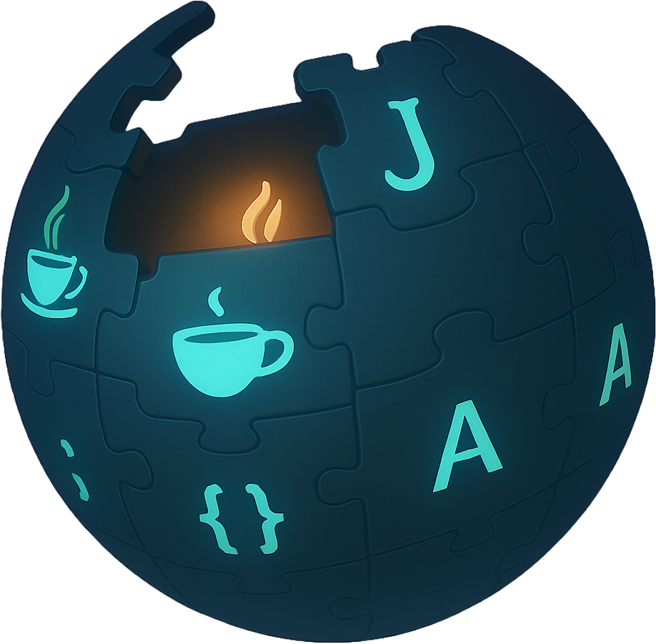

  

____

Welcome to the <b>Java-FT-01-Bahrain Class Wiki</b>.

This repository is a place where links to all of the course content that we cover can be found. Content is organized by <i>Unit</i> and <i>Week</i> with lesson repos for each day.
<!-- 
|  |  |  |  |
| :---: | :---: | :---: | :---: | -->

____

<strong>Team</strong>

<ul type="none">

<li>

<strong>Instructors</strong>

____

  
  <h3>Saad Iqbal</h3>
  <h4>Senior Instructor Lead</h4>
  
Hello! My name is Saad Iqbal, and I'll be serving as the Instructor Leads throughout this course. 

  
 As a software engineer with 15 years of industry experience, I have a deep passion for training people and solving complex problems.

  
I've been with General Assembly for over 7 years, and I'm currently in Bahrain, where I've been for the last four years. My expertise spans across programming languages like Java, .NET, Python, and the MERN stack. I also enjoy problem-solving and working with complex logical issues. I'm excited to be here and look forward to working with you!

  <a href="https://github.com/saadkhan29" target="_blank">GitHub</a> | <a href="https://www.linkedin.com/in/saad-iqbal-6623a262/" target="_blank">LinkedIn</a>
   

____

  
  <h3>Maryam Din</h3>
  <h4>Instructor Associate</h4>
  
Hello! My name is Maryam Din, and I’ll be joining you as one of your Instructor Associates for this full-time Java Developer Immersive Course.

  
I actually started out just like many of you — as a student in the first ever full-time Java bootcamp — so I know exactly how challenging (and rewarding!) this experience can be. I’m passionate about helping others grow their confidence in coding, breaking down complex problems, and celebrating those “I finally got it!” moments together.

  
Over the next three months, I’ll be here to support you in any way I can — whether that’s reviewing concepts, debugging tricky code, or just chatting about your progress (or your favorite late-night coding snacks 😄). I’m really looking forward to seeing you all grow into confident developers!

  <a href="https://www.linkedin.com/in/bymrmak/" target="_blank">LinkedIn</a>
   
  

____

  
  <h3>Zainab Alzaimoor</h3>
  <h4>Instructor Associate</h4>
  
 Hello! My name is Zainab Alzaimoor, and I’m excited to be joining you as an Instructor Associate for this Full-Time Java Developer Immersive.

  
 I recently completed a part-time Java Development Bootcamp with General Assembly, and I have experience working with Java and the Spring Boot framework. 

  
 I really enjoy solving problems and figuring out how things work, and I’m excited to be here to share what I’ve learned and support you throughout the bootcamp. I’m always happy to help, whether you’re stuck on a problem or just need someone to work through it with you. I’m really looking forward to sharing this journey with you all and seeing where it takes you! 

   <a href="https://bh.linkedin.com/in/zainab-al-zaimoor" target="_blank">LinkedIn</a>

</li>

<li>

<strong>Student Success</strong>

This team's job is to ensure your success <i>during</i> the course. Any scheduling, holiday, or performance questions can be directed to them.

  
  <h3>Reem</h3>
  <h4>Student Success Advocate</h4>
    <!-- 
Hello everyone, I am a default placeholder for an instructors introduction paragraph. This instructor's role will be to be a faceless representation of what an instructor might be, but nothing more. They will lead no lessons, they will offer no help, they will father no sons. They are void.

  
I am nothing but a filler for where an instructor might put their personal brand statement! I just sit here and fill space so that the developer can see what it might look like when an instructor has actually provided them with their intro. Ihave no purpose beyond that and my existence is meaningless!

    <a href="https://www.linkedin.com/">LinkedIn</a>
    -->

</li>

____

<li>

<strong>Outcomes</strong>

This team's job is to ensure your success <i>after</i> the course is complete. Any job search, resume, LinkedIn, or interview questions can be directed to them.

  
  <h3>Esraa Haji</h3>
  <h4>Career Coach</h4>
    <!-- 
Hello everyone, I am a default placeholder for an instructors introduction paragraph. This instructor's role will be to be a faceless representation of what an instructor might be, but nothing more. They will lead no lessons, they will offer no help, they will father no sons. They are void.

  
I am nothing but a filler for where an instructor might put their personal brand statement! I just sit here and fill space so that the developer can see what it might look like when an instructor has actually provided them with their intro. I have no purpose beyond that and my existence is meaningless!

    <a href="https://www.linkedin.com/">LinkedIn</a>
    -->

</li>

</ul>

____

<strong>Class Policies</strong>

Below, you will find Class Policies and Requirements as laid out in Orientation and conveyed by the Instructional Team.  We compile them here for your reference and review.

<ul type="none">

<li>

<strong>Code of Conduct</strong>

<ul>
  <li>Foster a productive classroom environment.</li>
  <li>Treat others with respect and dignity.</li>
  <li>Remember that everyone is coming at this with a different background.</li>
  <li>Professionalism in all methods of communication, both in-person <i>and</i> online.
    <ul>
      <li>Slack is an extension of our on-campus community. We ask that you remain courteous, respectful, and professional while engaging on Slack.</li>
    </ul>
  </li>
  <li><b>Zero tolerance for plagiarism and cheating.</b></li>
</ul>

</li>

____

<li>

<strong>Deliverable Submission Requirements</strong>

<ul>
  <!-- <li>Deliverables must be submitted following the <a href="https://github.com/SEB-Core/pr_template">PR Guidelines</a>.</li> -->
  <li>Students must meet deliverable requirements for the submission to be marked as "Complete".</li>
  <li>Deliverables are <i>always</i> due the following class day at the beginning of class, unless otherwise stated.</li>
  <li>There is a grace period for re-submission or late submission.  All re-submits/late submits are due <b>as soon as possible</b>.</li>
</ul>

</li>

____

<li>

<strong>Graduation Requirements</strong>

<ul>
  <li>Meet Project Requirements.
    <ul><li>Satisfactorily complete and present a project for <i>each</i> of the <b>4</b> units.</li></ul>
  </li>
  <li>Submit and complete a <i>minimum</i> of <b>80%</b> of deliverables (labs, homework, etc.).</li>
  <li>Adhere to attendance policy.
    <ul>
      <li>Students are allowed <b>Six (6)</b> absences over the <i>entire</i> course.</li>
      <li><b>Three (3)</b> tardies or early departures equals <b>One (1)</b> absence.</li>
      <li>Absence and Tardy policy <i>includes</i> attending ALL Outcomes career coaching sessions.</li>
    </ul>
  </li>
</ul>

</li>

____

<li>

<strong>A Note on Plagiarism</strong>

<ul>
  <li>Plagiarism is a serious offense and grounds for immediate withdrawal.</li>
  <li>You are encouraged to ask others, including students, instructors, and sites like <i>Stack Overflow</i> for help. However, it is <b><i>not acceptable to copy</i></b> another persons code and submit it as your own. More importantly, it is detrimental to your own learning and growth.</li>
  <li>Small snippets of code that solve small problems taken from sites like <i>Stack Overflow</i> are generally an exception to this rule. If you aren't sure, it is your responsibility to <b><i>ask your instructor</i></b>. To be on the safe side, we ask that you credit the person/resource you got the code from in a comment, and let an instructor take a look at it.</li>
  <li>AI predictive and language models such as ChatGPT, Deepseek, Grok, Perplexity, Google Gemini, or others should <i>only</i> ever be used as a learning tool or as a way to make you better. <i>Never</i> use these tools to replace learning. Code lifted directly from one of these sources <i>can be</i> considered plagiarism and is very easy to identify.</li>
</ul>

</li>

____

<li>

<strong>Observed Holidays</strong>

<!-- 

The following dates are observed Holidays for this course.  There will be no class days on or within any of the date ranges listed below.  These will not decrease the overall length of the course, but add on additional replacement days to the end to fulfill the 12 weeks. If you have any questions regarding Holidays, or have a special circumstance, please don't hesitate to reach out to your Instructional Team.

 -->

There are <i>no observed Holidays</i> that fall during the dates of this course. If you have any questions regarding Holidays, or have a special circumstance, please don't hesitate to reach out to your Instructional Team.

<!-- <table>
  <tr>
    <th>Holiday</th>
    <th>Date(s)</th>
  </tr>
  <tr>
    <td>
      

    </td>
    <td>
      

    </td>
  </tr>
</table> -->

</li>

</ul>

____

<strong>Unit 1</strong> - JAVA Fundamentals 

<ul type="none">

  <!-- 
  
 -->

  <li>

<strong>Week 1</strong>

  <table>
    <tr>
      <th>Sunday</th>
      <th>Monday</th>
      <th>Tuesday</th>
      <th>Wednesday</th>
      <th>Thursday</th>
    </tr>
    <tr>
      <td>
        <a href="/Lessons/installfest">Installfest</a>
         

        <a href="/Lessons/git-intro/">Git and GitHub</a>
         

        <a href="/Lessons//agile-user-stories-lesson/">Agile and User Stories</a>
         

                <a href="/Lessons/my-first-java-lesson/">My First Java Lesson</a>
         

        <a href="/Lessons/writing-user-stories/">Writing User Stories - Homework (Deliverable)</a>
         

      </td>
      <td>
        <a href="/Lessons/data-types-and-variables-lesson/">Datatypes And Variables</a>
         

        <a href="/Lessons/control-flow-and-loops-lesson/">Control Flow and Loops</a>
         

        <a href="/Lessons/control-flow-and-loops-lesson/lab.md">Control Flow and Loops - Lab</a>
         

        <a href="/Lessons/methods-and-scope-lesson/">Methods And Scope</a>
         

        <a href="/Lessons/methods-and-scope-lesson/lab.md">Methods And Scope - Lab</a>
         

        <a href="/Homeworks/methods-and-scope-lesson/README.md">Methods And Scope - Homework (Deliverable)</a>
         

      </td>
      <td>
        <a href="/Lessons/arrays-arraylists-lesson/">Arrays and ArrayLists</a>
         

        <a href="/Lessons/linkedlists-maps-lesson">LinkedLists and Maps</a>
         

        <a href="/Homeworks/organizing-information-lab">Collections Homework (Deliverable)</a>
         

      </td>
      <td>
       <a href="/Lessons/intro-to-oop/">Intro to Object-oriented programming (OOP)</a>
         

        <a href="/Lessons/objects-and-classes/">Objects and Classes</a>
         

        <a href="/Labs/OOPs/README.md">Objects and Classes - Lab</a>
         

        <a href="/Homeworks/creating-classes-lab-hw">Classes Homework</a>
         

        Additional Material on Agile methodology
         
        <a href="/Lessons/agile-extreme-programming">Extreme Programming</a>
         

      </td>
      <td>
        <a href="/Lessons/subclasses/">Inheritance (Subclasses)</a>
         

        <a href="/Lessons/subclasses/">Inheritance (Lab)</a>
         

        <a href="/Homeworks/shapes-lab/">Inheritance Homework (Deliverable)</a>
         

      </td>
    </tr>
  </table>
  

</li>

  ___

  <li>

<strong>Week 2</strong>

 <table>
    <tr>
      <th>Sunday</th>
      <th>Monday</th>
      <th>Tuesday</th>
      <th>Wednesday</th>
      <th>Thursday</th>
    </tr>
    <tr>
      <td>
      <a href="/Lessons/abstract-classes-and-interfaces">Abstract Classes And Interfaces</a>
         

        <a href="/Labs/OOPs/">Hands-On Coding Labs</a>
         

      <a href="/Homeworks/inheritance-and-abstraction-lab-hw/">Abstraction Homework (Deliverable)</a>
         

        <a href="">Complete Pending Deliverables</a>
         

      </td>
      <td>
        <a href="/Lessons/lambdas-and-streams/">Lambdas and Streams</a>
         

        <a href="/Lessons/lambdas-and-streams/">Lambdas and Streams</a>
         

        <a href="/Homeworks/lambdas-and-streams-lab-hw">Lambdas And Streams Homework (Deliverable)</a>
         

      </td>
      <td>
      <a href="/Lessons/optionals/">Optionals</a>
         

      <a href="/Lessons/java-tdd/">JUnit and Test Driven Development (TDD)</a>
         

        <a href="/Projects/Project-01-Banking-With-JAVA/">Project 01</a>
         

      </td>
      <td>
        <a href="/Projects/Project-01-Banking-With-JAVA/">Project 01</a>
         

      </td>
      <td>
        <a href="/Projects/Project-01-Banking-With-JAVA/">Project 01</a>
         

      </td>
    </tr>
  </table>

____

  <li>

<strong>Week 3</strong>

  <table>
    <tr>
      <th>Sunday</th>
      <th>Monday</th>
      <th>Tuesday</th>
      <th>Wednesday</th>
      <th>Thursday</th>
    </tr>
    <tr>
      <td>
        <a href="/Projects/Project-01-Banking-With-JAVA/">Project 01</a>
         

      </td>
      <td>
        <a href="/Projects/Project-01-Banking-With-JAVA/">Project 01</a>
         

      </td>
      <td>
        <a href="/Projects/Project-01-Banking-With-JAVA/">Project 01</a>
         

      </td>
            <td>
        <a href="/Projects/Project-01-Banking-With-JAVA/">Project 01</a>
         

      </td>
      <td>
        <a href="/Projects/Project-01-Banking-With-JAVA/">Project Presentations</a>
         

      </td>
    </tr>
  </table>

</li>
</ul>

____

<strong>Resources</strong>

Below is a list of additional resources that were hand-picked by your instructors. If you find that you don't have the time during the course, these resources will still help to solidify your understanding of key concepts after graduation.

  <ul type="none">

  <li>

<strong>Tools</strong> - <i>things to make you more efficient</i>

  - [Rectangle](https://rectangleapp.com/)
  - [Magnet](https://apps.apple.com/us/app/magnet/id441258766?mt=12)
  - [Flycut](https://apps.apple.com/us/app/flycut-clipboard-manager/id442160987?mt=12)
  - [Trello](https://trello.com/)
  - [Airtable](https://www.airtable.com/)
  - [Asana](https://asana.com/)
  - [Freehand](https://www.invisionapp.com/freehand)
  - [LucidChart](https://www.lucidchart.com/pages/)
  - [Excalidraw](https://excalidraw.com/)
  - [draw.io](https://app.diagrams.net/)
  - [Whimsical](https://whimsical.com/)
  - [Canva](https://www.canva.com/)
  - [Figma](https://www.figma.com/)
  - [daily.dev](https://daily.dev/)
  - [JSONPlaceholder](https://jsonplaceholder.typicode.com/)
  - [Replit](https://replit.com/)
  - [JSON Visualizer](https://jsoncrack.com/)
  - [ColorSlurp](https://apps.apple.com/us/app/colorslurp/id1287239339)
  - [Mac2Imgur](https://formulae.brew.sh/cask/mac2imgur)

  

</li>

  ____

  <li>

<strong>Practice</strong> - <i>sites to hone your skills</i>

  - [CodeCademy](https://www.codecademy.com/catalog)
  - [freeCodeCamp](https://www.freecodecamp.org/learn/)
  - [Codewars](https://www.codewars.com)
  - [Udemy](https://www.udemy.com/)
  - [Programiz](https://www.programiz.com/)
  - [#JavaScript30](https://javascript30.com/)
  - [CSS Battle](https://cssbattle.dev/)
  - [Flexbox Froggy](https://flexboxfroggy.com/)
  - [Grid Garden](https://cssgridgarden.com/)
  - [CSS Diner](https://flukeout.github.io/)
  - [CodePip](https://codepip.com/)
  - [Flexbox Zombies](https://mastery.games/flexboxzombies/)
  - [Flexbox Defense](http://www.flexboxdefense.com/)
  - [Screeps](https://screeps.com/)
  - [UX Design Masterclass](https://uxdesignmasterclass.com/)

  

</li>

  ____

  <li>

<strong>Bookmarks</strong> - <i>must-have resources</i>

  - [W3Schools](https://www.w3schools.com/)
  - [CSS Tricks](https://css-tricks.com/)
  - [MDN Web Docs](https://developer.mozilla.org/en-US/)
  - [Stack Overflow](https://stackoverflow.com/)
  - [Eloquent JavaScript](https://eloquentjavascript.net/)
  - [Code Analogies](https://www.codeanalogies.com/)

  

</li>

  ____

  <li>

<strong>Reading</strong> - <i>helpful articles and topics</i>

  - [10 Need-to-know Mac Terminal Commands](https://scotch.io/bar-talk/10-need-to-know-mac-terminal-commands)
  - [Rubber Duck Debugging](https://rubberduckdebugging.com/)
  - [Medium: What Is An API?](https://medium.com/free-code-camp/what-is-an-api-in-english-please-b880a3214a82)
  - [Medium: Higher Order Functions](https://medium.com/javascript-in-plain-english/4-must-know-higher-order-functions-in-javascript-411f85545881)
  - [Medium: Local Git Repos vs Remote Repos](https://medium.com/swlh/git-local-repo-and-github-remote-repo-eae1c948fbf5)
  - [Medium: Explaining API's](https://medium.com/javascript-in-plain-english/many-developers-struggle-with-explaining-apis-20a071d74596)
  - [Naming Conventions in Database Modeling](https://vertabelo.com/blog/naming-conventions-in-database-modeling/)
  - [JSON Web Tokens](https://jwt.io/introduction/)
  - [Beautify Your GitHub Profile](https://github.com/rzashakeri/beautify-github-profile)
  - [Those HTML Elements You Never Use](https://dev.to/eludadev/those-html-elements-you-never-use-16bi)

  

</li>

  ____

  <li>

<strong>Documentation</strong> - <i>commonly used tech docs</i>

  - [MDN JavaScript Docs](https://developer.mozilla.org/en-US/docs/Web/JavaScript/Guide)
  - [W3Schools CSS Docs](https://www.w3schools.com/cssref/default.asp)
  - [React Docs](https://reactjs.org/docs/getting-started.html)
  - [Mongoose Docs](https://mongoosejs.com/)
  - [PostgreSQL](https://www.postgresql.org/docs/)
  - [Sequelize Docs](https://sequelize.org/docs/v6/)
  - [Python Docs](https://docs.python.org/3/)
  - [Django Docs](https://docs.djangoproject.com/en/4.0/)
  - [Airbnb Style Guide](https://github.com/airbnb/javascript)

  

</li>

  ____

  <li>

<strong>Cheatsheets</strong> - <i>quick references</i>

  - [Mac Terminal Commands Cheatsheet](https://www.makeuseof.com/tag/mac-terminal-commands-cheat-sheet/)
  - [OhMyZsh Cheatsheet](https://github.com/ohmyzsh/ohmyzsh/wiki/Cheatsheet)
  - [VSCode Keyboard Shortcut Cheatsheet](https://code.visualstudio.com/shortcuts/keyboard-shortcuts-macos.pdf)
  - [Markdown Cheatsheet](https://www.markdownguide.org/cheat-sheet/)
  - [JavaScript Cheatsheet](https://websitesetup.org/javascript-cheat-sheet/)
  - [ES6 Cheatsheet](https://devhints.io/es6)
  - [MongoDB Cheatsheet](https://www.mongodb.com/developer/products/mongodb/cheat-sheet/)
  - [ERD Cheatsheet](https://drive.google.com/file/d/0B_spkK3eZiHmZTZhczVTaVZxUFU/view?resourcekey=0-pvJ1STXJ4xEpjqpFWQtUhg)
  - [iOS Resolutions](http://iosres.com/)
  - [Flexbox Playground](https://codepen.io/GAmarketing/pen/QWWJvLx)
  - [LayoutIt!](https://grid.layoutit.com/)
  - [Named Colors & Hex Equivalents](https://css-tricks.com/snippets/css/named-colors-and-hex-equivalents/)
  - [Regex Cheatsheet](https://www.rexegg.com/regex-quickstart.html)

  

</li>

  ____

  <li>

<strong>Deployment</strong> - <i>get your projects online</i>

  - [Surge](https://surge.sh/)
  - [Surge Static Deployment](https://staticdeployment.surge.sh/)
  - [Surge React Deployment](https://reactdeployment.surge.sh/)
  - [Fly.io](http://fly.io)
  - [Fly.io Express Deployment](https://expressdeployment.fly.dev/)
  - [Render](http://www.render.com)
  - [Render Express Deployment](https://expressdeployment.onrender.com/)
  - [Heroku](https://www.heroku.com/)
  - [Netlify](https://www.netlify.com/)
  - [Vercel](https://vercel.com/)
  - [AWS](https://aws.amazon.com/codedeploy/)
  - [Railway](https://railway.app)

  

</li>

  ____

  <li>

<strong>CSS Libraries</strong> - <i>use different libraries to ramp up your apps</i>

  - [Nostalgic](http://nostalgic-css.github.io/)
  - [Jdan](http://jdan.github.io/)
  - [Bootstrap](https://getbootstrap.com/)
  - [Kushagra](http://kushagra.dev/)
  - [Tachyons](http://tachyons.io/)
  - [Bulma](https://bulma.io/)
  - [Foundation](https://foundation.zurb.com/)
  - [Skeleton](http://getskeleton.com/)
  - [Groundwork](https://groundworkcss.github.io/)
  - [Victory Chart Visualizations](https://formidable.com/open-source/victory/)
  - [TailwindCSS](https://tailwindcss.com/)
  - [Material UI](https://mui.com/)
  - [Materialize](https://materializecss.com/)
  - [Semantic UI](https://semantic-ui.com/)
  - [React MD](https://mlaursen.github.io/react-md-v1-docs/#/)
  - [React Suite](https://rsuitejs.com/)
  - [React Rainbow](https://react-rainbow.io/)

  

</li>

  ____

  <li>

<strong>Animations, Images, Sounds, Fonts & Icons</strong> - <i>add fun CSS to your projects</i>

  - [Animate Style](https://animate.style/) - animations
  - [CSS Wand](https://www.csswand.dev/) - animations
  - [Wah.css](http://www.joerezendes.com/projects/Woah.css/) - animations
  - [LottieFiles](https://lottiefiles.com/) - animations
  - [react-spring](https://react-spring.dev/) - React animations
  - [500+ icons](https://css.gg/) - icons
  - [Font Awesome](https://fontawesome.com/?from=io) - icons
  - [Kenney](https://www.kenney.nl/assets) - assets
  - [Google Fonts](https://fonts.google.com/) - fonts
  - [Font Joy](https://fontjoy.com/) - fonts
  - [WebFont Generator](https://www.fontsquirrel.com/tools/webfont-generator) - fonts
  - [CSS Gradient](https://cssgradient.io/) - gradients
  - [Trianglify](https://trianglify.io/) - poly backgrounds
  - [Unsplash](https://unsplash.com/) - images
  - [Pixabay](https://pixabay.com/) - images
  - [Open Game Art](https://opengameart.org/) - images
  - [Imgur](https://imgur.com/) - images
  - [Itch](http://itch.io/) - images
  - [Lorem Picsum](https://picsum.photos/) - images
  - [Zap Splat](http://zapsplat.com/) - sounds
  - [Open Game Art](https://opengameart.org/content/library-of-game-sounds) - sounds
  - [FreeSound.org](https://freesound.org/) - sounds

  

</li>

  ____

  <li>

<strong>Color Palettes</strong> - <i>color match or check out color schemes</i>

  - [Color Hunt](https://colorhunt.co/)
  - [Flat UI Colors](https://flatuicolors.com/)
  - [Coolors](https://coolors.co/)
  - [Color palette Generator](https://www.canva.com/colors/color-palette-generator/)
  - [Happy Hues](https://www.happyhues.co/)
  - [MaterialUI](https://www.materialui.co/flatuicolors)
  - [Adobe Color](https://color.adobe.com/create/color-wheel)
  - [PaletTab](https://palettab.com/)

  

</li>

  ____

   <li>

<strong>AI</strong> - <i>use these tools to make yourself a better human</i>

  - [ChatGPT](https://chatgpt.com/)
  - [Grok](https://x.ai/grok)
  - [Google Gemini](https://gemini.google.com/)
  - [Perplexity](https://www.perplexity.ai/)
  - [Notebook LM](https://notebooklm.google.com/)

  

</li>

  ____

  <li>

<strong>YouTube Channels</strong> - <i>watch and learn</i>

  - [Net Ninja](https://www.youtube.com/channel/UCW5YeuERMmlnqo4oq8vwUpg)
  - [Fireship](https://www.youtube.com/c/Fireship)
  - [JavaScript30](https://www.youtube.com/hashtag/javascript30)
  - [Hussein Nasser](https://www.youtube.com/channel/UC_ML5xP23TOWKUcc-oAE_Eg)
  - [Programming with Mosh](https://www.youtube.com/user/programmingwithmosh)
  - [GitHub Training & Guides](https://www.youtube.com/githubguides)
  - [Web Dev Simplified](https://www.youtube.com/channel/UCFbNIlppjAuEX4znoulh0Cw)

  

</li>

___
